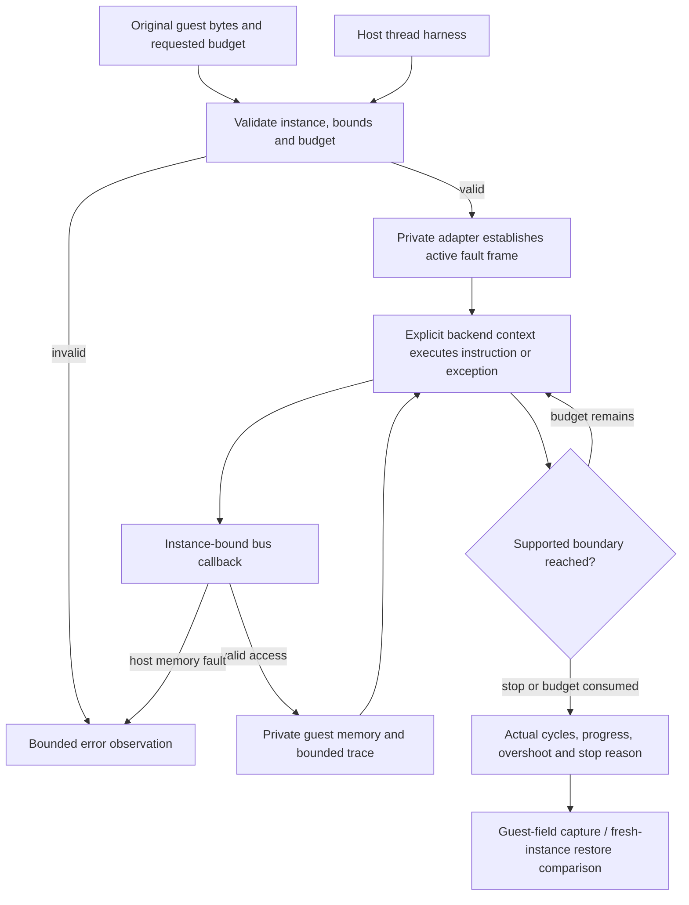

# Phase 1: CPU acceptance experiment - Research

**Researched:** 2026-10-01
**Domain:** Private C 68000 backend qualification
**Confidence:** MEDIUM for source-grounded planning; feasibility unproved

<user_constraints>
## User Constraints (from CONTEXT.md)

The following decision and discretion text is copied verbatim from the phase context. It records authorized automatic decisions, not new individual user answers. [CITED: 01-CONTEXT.md]

<!-- DATA_3baf179c_START -->
### Locked Decisions

IDs below are local to Phase 1; preparation D-01–D-44 remain separate historical provenance.

### Bounded candidate experiment

- **D-01:** Investigate Musashi at `313ebf1bd9f4d0d93341eb5ce21fd8a119e9dbdd` as one candidate. Do not implement multiple production backends or an all-new CPU during this phase. Failure produces a counterexample and replacement/replanning decision.
- **D-02:** Allow at most two substantive adaptation attempts. The planner must inspect the source and set an explicit numeric budget for changed handwritten upstream files/lines, account separately for reproducible generated output, and record stopping/repair rules **before any adaptation**. Acceptance is bounded by both attempts and that patch budget. An exceeded cap is a reported rejection/replan condition, not permission to expand silently.
- **D-03:** Keep the experiment private and reviewable. Use enough CMake/CTest scaffolding and original guest input to reproduce results; do not freeze a public ABI, implement future devices, or turn the experiment into a full emulator fork.

### Compiled closure and host safety

- **D-04:** Prefer a demonstrated minimal 68000 source closure. Inventory every copied, generated, compiled and distributed file at its immutable identity, including generator provenance. Prove FPU/SoftFloat exclusion if claimed; build flags or unused runtime paths alone are insufficient. If any files remain, document their actual notices, obligations and host-call disposition before admission.
- **D-05:** Retain all applicable notices and document small upstream patches. The experimental runtime must remain C and cannot call process exit, perform ambient file/device/network/environment I/O, or use wall clock for guest execution. Dependency guest errors must return bounded observations/errors to the harness without terminating its host.
- **D-06:** Inventory every mutable global, lazy-initialized table, callback, counter, exception field and host jump buffer. A context copy, global current-instance pointer, thread-local current-instance workaround or global execution lock does not fulfill the opaque independent-instance direction. Shared tables must be immutable with safe construction; per-machine mutation belongs to an explicit instance.

### Observable timing and continuation

- **D-07:** Start with a qualified instruction-boundary execution contract, reporting actual guest progress and any overshoot. Include the selected interrupt/exception and stop/resume cases needed for the tiny guest experiment. Do not imply arbitrary bus-cycle suspension, Neo Geo board accuracy or original BIOS compatibility from CPU cycle totals.
- **D-08:** Capture and restore all mutable **backend guest** state at defined supported boundaries, then compare uninterrupted and restored execution/observations. Host pointers, callback identities and jump buffers are rebound or reconstructed; they are not serialized guest data. This remains a private experimental representation, without a public snapshot/ABI compatibility promise.

### Acceptance evidence and failure disposition

- **D-09:** Use a small original, redistributable guest and hand-justified expectations from exact CPU primary references. Include meaningful guest-computed memory/register effects and a consequential wrong-behavior control. Emulator agreement retains its ancestry and does not replace the independent oracle. Full board bootstrap/BSS evidence belongs to Phase 2; CPU reset/startup assumptions used here must still be explicit.
- **D-10:** Compare distinguishable isolated, interleaved and concurrent instances, simultaneous cold initialization and failing creation/teardown paths. Compare guest state/observations at equal boundaries. Audit plus supported race/safety instrumentation and meaningful behavioral stress provide separate evidence; unavailable tools must be recorded honestly.
- **D-11:** Begin on the available native toolchain and run useful additional toolchains when available. Record exact compiler/configuration/architecture identities and unsupported/skipped outcomes. This experiment does not establish the release platform matrix. Keep host threading/test mechanisms outside the all-C runtime's host-independent contract.
- **D-12:** Acceptance requires CPU-01–CPU-04 evidence and CPU-05's documented decision. A rejection satisfies only the decision obligation. Preserve failures and counterexamples; do not weaken isolation/timing/rights requirements, regenerate goldens, or claim Phase 1 complete to enable Phase 2. Reconcile any necessary scope change explicitly with the roadmap.

### Agent's Discretion

The brief delegates routine technical choices. The researcher/planner chooses the finite numeric patch budget from inspected source, private harness structure, exact instruction cases, field encoding and fault injection strategy. Those choices must implement the decisions above and remain testable within the recorded cap. No external credentials or physical hardware are prerequisites for this local experiment; unavailable physical evidence narrows its claim.

### Deferred Ideas (OUT OF SCOPE)

- Public native SDK lifecycle/media API, full board diagnostic/bootstrap and installed consumers — Phase 2.
- Release platform matrix, protected hosted delivery, release-please and downloadable alpha — Phase 3.
- Z80/YM2610 implementation, selected graphics/input/audio, real RetroArch macOS, public snapshot continuation and durable persistence — next milestone.
- Commercial BIOS/game compatibility and representative gameplay optimization — later evidence-driven milestones.
<!-- DATA_3baf179c_END -->
</user_constraints>

## Summary

The pinned Musashi candidate requires a real source adaptation. Its nominal context contains registers and callbacks, while execution counters, trace/address-space state, error information, jump buffers, default callback observations and initialization state also exist globally. Opcode dispatch and cycle tables are constructed lazily. The generator emits context-free handler signatures. An adapter around context copying cannot satisfy the independent-instance requirement. [CITED: S1 lines 41–95, 536–607, 1087–1109, 1165–1181; S2 lines 938–1038; S3 lines 112–181; S4 lines 786–790]

The source also exposes risks beyond reentrancy: unconditional FPU/MMU inclusion, SoftFloat types in the CPU structure, a process-exiting FPU error helper, a 68010-specific bus-error frame, reset-cycle accounting and error traps established after interrupt service begins. These are source findings requiring focused experiments, not demonstrated runtime failures. [CITED: S1 lines 41–52, 958–982; S2 lines 99–100, 953, 1932–1971; S5 lines 1–14]

**Primary recommendation:** Freeze the budget below, then build one explicit-context, 68000-only experimental closure and immediately run an original guest. Use instance-owned dispatch/cycle storage initially to avoid adding a table-generation redesign. Reject if isolation, host safety or the supported timing/state seam cannot be achieved within the cap. This is a proposed implementation strategy under delegated discretion, not an acceptance result. [ASSUMED: A1]

## Architectural Responsibility Map

The phase uses native C components, not browser/server/database tiers. The following is the proposed responsibility assignment. [ASSUMED: A2]

| Capability | Primary Tier | Secondary Tier | Rationale |
|---|---|---|---|
| Guest register execution, exceptions, cycle accounting | Native backend instance | Private adapter | Machine state and execution control remain explicit |
| Memory bounds, byte order, bus observations | Private test bus | Backend callbacks | The experiment supplies buffers; CPU callbacks cannot own host files |
| Budget validation, supported stop boundary, fault outcome | Private adapter | Backend | Adapter rejects invalid calls before execution |
| Backend continuation | Private state codec | Harness memory copy | Separate guest fields from host bindings and derived tables |
| Concurrent creation/execution | Host test executable | CTest launcher | Threads synchronize independent instances, never serialize core execution |
| Generation, inventory and evidence | Host tools | CMake/CTest | Host tools may use files; they never enter runtime linkage |

<phase_requirements>
## Phase Requirements

Descriptions below are copied from the active CPU admission requirements. [CITED: .planning/REQUIREMENTS.md, CPU Admission]

| ID | Description | Research Support |
|---|---|---|
| CPU-01 | A maintainer can reproduce the exact C 68000 candidate build from pinned sources and a per-file copied/generated/compiled/distributed inventory with license notices and host-call disposition, including proof of whether FPU/SoftFloat is excluded or retained. | Minimal closure, provenance ledger, no ambient host-call link audit |
| CPU-02 | A maintainer can run distinguishable CPU instances alternately and concurrently, including simultaneous cold initialization and failing creation/teardown paths, with results matching isolated baselines and no shared mutable machine state. | Explicit context propagation, instance-owned table construction, barrier-started cold runs |
| CPU-03 | A maintainer can observe actual guest progress, stop/overshoot behavior and the selected interrupt/exception interactions in a bounded execution experiment whose timing precision and unsupported behavior are documented. | Zero/reset/overshoot/STOP/IRQ/TRAP/address-error cases; equal-boundary comparisons |
| CPU-04 | A maintainer can inspect a complete mutable-state and callback inventory and reproduce backend continuation at supported boundaries without serializing host pointers or jump buffers; this establishes no public board-snapshot format. | Field classification and fresh-instance restore with rebinding |
| CPU-05 | A maintainer receives an explicit backend accept/reject/defer decision against an effort and patch budget set before adaptation, with commands, results and counterexamples; an over-budget or failed candidate triggers replacement/replanning before SDK integration. | Quantitative caps, two attempts, preserved counterexamples and admission receipt |
</phase_requirements>

## Project Constraints (from AGENTS.md)

All directives below are actionable project constraints, summarized from the complete root instructions read this session. [CITED: AGENTS.md]

- Begin with current project/state/requirements/roadmap; use the preparation index and decisions for provenance. Historical proposals and sibling receipts are not implemented behavior.
- Keep runtime and selected runtime dependencies in C; adopt C17, target-based CMake, CTest and pinned Unity, and prove actual platform support.
- Keep the core independent of frontend, filesystem, devices, graphics, network, secrets and wall clock; use opaque per-instance state, explicit ownership/buffers/errors and deterministic time.
- Audit every imported mutable global, callback, initialization race and state field. Keep changes small, pinned, licensed and documented.
- Prefer concrete modules, defined integer behavior, explicit byte order and checked limits; hardware comments explain evidence/timing. Optimize only from representative profiles.
- Separate guest time and host pacing; preserve hardware slowdown unless a documented option changes it.
- Separate durable saves, snapshots, replay and public ABI identities; demonstrate continuation and isolation before claiming them.
- Prefer primary sources; retain revision/date, uncertainty and oracle ancestry. Emulator output is not automatically hardware truth.
- Pair behavioral changes with proportional automated evidence and documentation in the same PR; use meaningful boundary, property, fuzz and consumer evidence.
- Record unsupported/skipped/unknown outcomes. Preserve failures, explain intentional baselines, and never relax budgets or change goldens to manufacture green results.
- Tie release/performance claims to exact code/dependency/configuration/input identities. Proposed numbers remain targets.
- Keep one current contract per topic and preserve dated provenance with supersession links; update stale examples.
- Use installed OpenGSD schemas/workflows, preserve preparation and keep current/next/longer-horizon milestone detail proportional.
- Standing authorization covers subagents, routine PRs, qualifying merges and releases; respect file ownership and do not revert others.
- Prefer branches/PRs, protected green main, current-revision checks and independent review; triage relevant issues/PRs at milestone start/shipping.
- Automate repeatable verification/release work; constrain human dependencies to genuinely unavailable authority or physical evidence and continue independent work.
- Keep CI small, measured and memory bounded; avoid duplicate preparation, preserve cold builds and fail-safe classification.
- Bind releases to tested commits/artifacts; stage before publishing and separate untrusted execution from publication authority.
- Original work is MIT. Preserve imported notices; audit dependencies and fixtures at immutable revisions. No commercial media redistribution without rights.
- Keep commercial ROMs/BIOS, private states/captures/results outside Git/public CI. Hashes do not confer rights.
- Runtime needs no secrets; ignored local automation configuration and CI secrets/nonsecret variables stay separate. Never dump secrets or environments.
- Exclude personal absolute paths, private identity/account URLs and machine identifiers from public sources, logs and archives; use public/noreply commit identity.
- Other projects used as evidence remain read-only.

## Standard Stack

Retain the already chosen stack; there is no fresh ecosystem selection in this phase. [CITED: 01-CONTEXT.md; .planning/research/STACK.md]

| Component | Exact selected/observed identity | Use and limitation |
|---|---|---|
| Musashi candidate | 313ebf1bd9f4d0d93341eb5ce21fd8a119e9dbdd; commit date 2026-03-08 | Source inspection and baseline host generation only; no accepted CPU runtime [CITED: S1–S6] |
| Unity, test-only | v2.7.0, b6763fbd9cedfacaa89e2ad9fd00d615a234e355; release date 2026-07-16 from prior ledger | Pinned README and MIT notice re-read; use explicit C runner, no Ruby/Ceedling dependency [CITED: S9; .planning/research/STACK.md S-10] |
| Language | C17 | Project decision; local generator and thread smoke compiled under this mode [CITED: AGENTS.md; E1] |
| CMake / CTest | Local 4.4.3; proposed project floor 3.24 not exercised here | Target-local requirements and test registration; do not assert minimum support [CITED: E1; .planning/research/STACK.md S-06] |
| Ninja | Local 1.13.2 | Developer build executor, not runtime dependency [CITED: E1] |
| Apple Clang / SDK | 21.0.0 (clang-2100.1.1.101), SDK 26.5 | Available native lane; other release lanes deferred [CITED: E1] |

**Installation:** Vendor audited subsets at immutable identities during execution; configure without downloads. This research imported nothing into the project. Do not install registry packages merely to implement the experiment. [ASSUMED: A2]

## Package Legitimacy Audit

The installed package-legitimacy seam was invoked for the C dependencies and rejected the unsupported ecosystem; its actual response was:

<!-- DATA_52cda2e8_START -->
> Error: Usage: gsd-tools package-legitimacy check --ecosystem &lt;npm|pypi|crates&gt; &lt;pkg1&gt; ...
<!-- DATA_52cda2e8_END -->

No registry verdict exists for either C source dependency. Do not mislabel them npm-verified, replace them with similarly named npm packages, or interpret this tool limitation as a suspicious-package result. Official repository pins and file-level provenance are the relevant admission gate. [CITED: E2; S1–S6; S9]

| Candidate | Registry | Age/downloads | Official source | Verdict / disposition |
|---|---|---|---|---|
| Musashi | None; vendored C source | Not used as a trust proxy | kstenerud/Musashi at selected commit | Tool unsupported; source/license/closure acceptance pending |
| Unity | None; vendored C source | Not used as a trust proxy | ThrowTheSwitch/Unity at selected commit | Tool unsupported; test subset must retain MIT notice |

No SLOP or SUS verdict was produced. No Node postinstall inspection applies. Read every copied Unity/core/generated-file notice during admission; official provenance alone does not prove the selected closure's legal or runtime safety. [CITED: E2; S9]

## Quantitative Adaptation Budget

Freeze this proposal in the first execution artifact before touching candidate source. The numbers are a delegated experiment bound, **not a claim that the adaptation will fit**. [ASSUMED: A1]

| Bound | Recommended hard cap |
|---|---|
| Candidate and substantive attempts | One specified commit; at most two adaptation attempts total |
| Active adaptation effort | 16 engineer/agent work hours total, at most 8 per attempt; record active elapsed work, excluding queues/tool downtime |
| Changed handwritten upstream files | At most 6: core source, internal header, external header, configuration, opcode input, generator |
| Handwritten upstream churn | At most 5,000 added + deleted lines against pristine selected files; no whitespace/reformat exclusion |
| Semantic repair subset | At most 500 of those added + deleted lines may change instruction, exception, error or cycle behavior; context/signature plumbing and build guards accounted separately |
| New adaptation-only support | At most 600 handwritten lines for transform helpers/shims; count these against the 5,000 total even outside upstream paths |
| Generated output | Two baseline opcode outputs; at most 50,000 total lines and 2 MiB; no hand edits |
| Broad new emulator implementation | None; no alternate production CPU, all-new CPU, FPU/MMU port or general framework |

Why this is a substantial but bounded patch: the inspected internal header contains 107 static-inline declaration lines; the opcode input has 657 lines containing internal-helper calls; baseline output has 1,967 handler definitions. The six likely edited upstream inputs total 16,282 lines. The generated baseline is 36,505 lines / 795,320 bytes. These are source-shape measurements, not an AST-complete call inventory. [CITED: E3; S1–S4]

Use normal diff numstat over pristine versus adapted selected files, including additions/deletions and any moved/replaced source. A replacement or appended macro shim cannot evade the cap. Preserve each attempt's starting revision, cumulative maximum churn, semantic repair count and generated digests. Do not reset effort/churn by moving work to a fresh file or branch. Test/harness/docs lines are separately reported; they cannot contain hidden backend adaptation. [ASSUMED: A1]

Attempt 1: explicit contexts plus minimal closure and tiny guest. Stop at the first cap violation or unresolved architectural incompatibility. Attempt 2 is one bounded repair of concrete counterexamples within the same overall cap, not a fresh allowance. After either attempt, a demonstrated unrepairable host escape, cross-instance mutation, unsupported selected timing/state behavior, unresolved rights issue or exhausted cap produces a rejection/defer receipt. Preserve CPU-01–04 as pending and propose a separate bounded replacement investigation or explicit roadmap revision. No alternative CPU is prequalified by this research. [ASSUMED: A1; CITED: 01-CONTEXT.md D-01/D-02/D-12]

## Architecture Patterns

### System Architecture Diagram

Proposed data flow. [ASSUMED: A2]



### Recommended Project Structure

Proposed paths below do not yet exist; names are planner choices, not verified repository values. [ASSUMED: A2]

```text
experiments/cpu/       private adapter, test bus, C runners and acceptance notes
third_party/musashi/   selected pinned and patched inputs plus generated output
third_party/unity/     pinned test-only C subset and notice
tests/cpu/             original guests, oracle notes, stress and fault cases
tools/cpu/             bounded regeneration, inventory and patch accounting
```

### Explicit context propagation, including indirect calls

Use a concrete backend object holding CPU state, outside-context execution state, instance-bound bus/callback bindings and transient active-call jump targets. Rename the upstream singleton reference to an expression derived from an explicit pointer parameter only. Passing a pointer to the top-level execute function without changing downstream dependencies is insufficient. [ASSUMED: A2; CITED: S1 lines 58–95; S2 lines 329–400]

Change signatures and every call site in the internal helper graph, forward declarations, exported private functions, opcode-template helper calls and generated function pointer types. Update the generator's handler declaration format and the table's handler pointer signature together; dispatch calls pass the same context. Audit macro expansions for implicit helper calls, default callbacks and calls through function pointers. Use a checked symbol list or syntax-aware transformation, preserve the transform recipe, and review the resulting diff. Pure arithmetic helpers can remain context-free when their complete dependencies are pure. [ASSUMED: A2; CITED: S2 lines 1034–1038 and helper bodies; S3 lines 112–149; S4 lines 786–790]

Bind external memory reads/writes and optional callbacks to explicit instance/userdata parameters. Remove the default callbacks' unused process-global observation storage; their useful behavior must use the explicit context. No current-instance global, TLS slot, signal-global routing or execution mutex is acceptable. [ASSUMED: A2; CITED: S1 lines 536–607; 01-CONTEXT.md D-06]

For the first bounded implementation, move dispatch and all existing cycle-table rows into each instance and build them during that instance's private construction. Retain only the existing constant opcode descriptor and constant arithmetic/exception tables as shared objects. Remove lazy global initialization. This preserves the table-building algorithm with a parameter instead of inventing a second opcode resolver. With 8-byte function pointers, existing table dimensions imply 851,968 bytes per instance before other state; report actual allocation and creation cost. Optimizing that cost through reproducibly generated const tables can be a later measured decision, not an unbudgeted prerequisite. [ASSUMED: A2; CITED: S3 lines 137–181, 184–271]

### Minimal compiled AND distributed closure

Select the core source/internal header/API header/configuration, generator/input, generated opcode source/header and their notices. Omit the disassembler and default upstream Makefile from runtime linkage. The generator is a separate host executable with file I/O/process exit explicitly allowed only there. Never compile the target runtime with generator sources. [ASSUMED: A2; CITED: S6; S4 lines 1241–1269]

For this 68000-only branch:

1. Remove or compile-time guard unconditional FPU/MMU inclusion and declarations; eliminate SoftFloat includes and FPU typed fields from the selected structure; remove/guard all surviving FPU/MMU template references. Variant runtime conditions alone do not remove distributed dependencies or guarantee an unoptimized build has no references.
2. Explicitly disable later CPU variants, PMMU, MAME integration and runtime logging. Reject non-68000 model selection at the adapter boundary; retain untouched later-variant text only if it has no dependency/host-call closure and is inventoried honestly.
3. Remove later-variant stderr paths from retained opcode templates or exclude them with compile-time guards. Audit assertions and debug logging in the selected preprocessed closure.
4. Build at no optimization with FPU/MMU/SoftFloat files physically absent from the admitted source subset. Collect compile dependencies, preprocessed includes and undefined-symbol/link-map evidence. Compare optimized and unoptimized linkage. The final inventory separately lists copied, generated, compiled and distributed files.
5. Keep pristine source hashes, patch recipe/hash, generator compiler/configuration, generated digests and license notice references. Rebuild generation in two fresh output directories and byte-compare.

These are proposed proof obligations, not completed exclusions. [ASSUMED: A2; CITED: S1 lines 41–52; S2 lines 99–100, 953–956; S3 FPU and PMMU handlers; S5; S6]

Core and opcode-template headers contain permissive grants requiring retained notices. SoftFloat's release-2b notice has distinct responsibility, indemnity and derivative-notice text; it cannot be described as the core's MIT grant. This report recommends exclusion, not a legal interpretation or permission to strip notices from retained derivatives. [CITED: S1 lines 4–27; S3 lines 9–32; S7 lines 4–29]

### Complete state inventory and boundary continuation

Execution must produce a field-by-field ledger from the **adapted compiled structure**, including fields added during repairs. Each field receives owner, mutability, callback access, snapshot class and restoration rule. The following source-derived groups establish the audit floor. [ASSUMED: A3; CITED: S1; S2 lines 938–1038]

| Source group | Required disposition |
|---|---|
| CPU registers and saved register bank, previous/current PC, stack banks, instruction register | Guest state; preserve all retained values even if not directly public |
| Trace/supervisor/master/condition flags, interrupt mask/level, stopped state, virtual IRQ bitmap, pending NMI | Guest state; continuation cases must make pending values consequential |
| Prefetch address/data, instruction mode, exception/reset run mode, remaining reset cycles | Guest or boundary state; preserve unless proven derived/irrelevant under selected configuration |
| Outside-context initial/remaining cycles, tracing, address-space and address-error address/write/function-code fields | Move to instance; classify canonical versus normalized transient boundary values explicitly |
| CPU model, masks and per-model timing constants | Fixed configuration or derived; validate selected model, reconstruct deterministically |
| Instruction/exception cycle pointers and opcode dispatch arrays | Derived host data; rebuild and bind, never serialize pointer bytes |
| Memory callback bindings, callback table, user pointer | Host ownership; bind to destination bus, never copy source identities |
| Address/bus/adapter jump targets, execution-active guard | Host call state; valid only during active C frame, reconstructed on each entry |
| FPU/MMU state | Excluded only after closure proof; otherwise inventory every retained field and dependency mutation |
| Default callback observations and initialization guard | Remove or instance-own; no shared mutation |
| MAME substate/log stream | Exclude from selected build |
| Constant shifts, exception timing, effective-address timing and descriptor tables | Shared immutable data; evidence must identify actual const declarations and absence of writes |

Do not memcpy the backend struct as the checkpoint format. Use explicit fixed-width scalar/array fields, validate into a temporary guest record, then apply while retaining destination bindings. At supported return boundaries, normalize scratch execution state only when the next execution provably overwrites it without effect. Save after reset with pending reset work, after normal instruction completion, after STOP, with masked IRQ/NMI pending, after handled exception and with populated prefetch. Restore into a newly created instance with a different bus allocation. Compare subsequent memory, register/state, trace and cycle observations at equal boundaries. Harness memory is copied separately: this is backend continuation evidence, not a board snapshot format. [ASSUMED: A3]

### Timing and host-fault mechanics

Propose positive bounded cycle requests completed at instruction/exception boundaries, actual elapsed cycles, overshoot, explicit stopped/fault outcomes, and zero-budget no-op enforced before backend entry. Clamp the accepted request so signed backend cycle arithmetic cannot overflow; maintain wider checked totals in the adapter. Retain progress separately from elapsed idle time when STOP consumes a requested interval without executing instructions. [ASSUMED: A4]

The upstream execute loop is a do/while, checks interrupts at entry, subtracts reset cost before establishing its cycle pool, and calls dispatch before checking remaining cycles. Consequently zero requests, reset-inclusive accounting and interrupt-plus-handler overshoot need separate regressions. Equal requested budgets are not necessarily equal guest boundaries. Queue IRQ changes between adapter calls; do not promise asynchronous mid-instruction scheduling. [CITED: S1 lines 958–1021, 1054–1079]

Establish per-call fault targets before any operation that can invoke the bus: reset vector fetch, interrupt acknowledge/vector/stack access, ordinary fetch and exception stacking. Do not longjmp to a frame from an earlier call. The Apple/BSD address-error macro has a parameter and forwards it, whereas the execute call and implementation are parameterless; reproduce and repair under the selected configuration rather than silently disabling the feature. [ASSUMED: A4; CITED: S1 lines 973–982, 1117–1156; S2 lines 619–667, 2058]

**68000 bus-error fidelity is not qualified by the upstream helper.** Its body explicitly uses the 68010 frame builder. For the initial experiment, map invalid host memory accesses to a bounded adapter fault, leave that failed instance non-resumable until reset/destruction, and keep real guest bus-error signaling unsupported. Qualify address error separately with valid vectors/stack, plus nested fault host survival. This narrows a named capability, not CPU-03's required selected exceptions: retain TRAP/illegal or privilege exception, IRQ/RTE and STOP/resume as mandatory guest cases. If those require broad exception redesign, reject within the budget. [ASSUMED: A4; CITED: S2 lines 1937–1971; S8 section 6.3]

## Don't Hand-Roll

Recommendations under the chosen stack. [ASSUMED: A2–A5]

| Problem | Do not build | Use instead |
|---|---|---|
| CPU implementation | New instruction engine during acceptance | Pinned candidate with bounded explicit-context patch |
| Assertions and test launcher | Homegrown framework | Small pinned Unity C runner and CTest |
| Opcode output maintenance | Manual edits to 1,967 generated handlers | Audited generator/template changes and byte-repeatable regeneration |
| Concurrent dispatch initialization | Hidden singleton once flag or global lock | Instance-owned construction from constant descriptors |
| Whole guest toolchain | New assembler/linker | Small annotated original byte fixture, verified against manual encodings |
| Host fault recovery | Swallow errors and continue corrupted execution | Explicit bounded adapter fault, recorded terminal state |
| Snapshot encoding | Raw struct bytes/pointers | Private explicit guest fields and validated rebinding |

## Runtime State Inventory

This phase adapts a freshly inspected candidate; it is not a deployed application migration. No existing runtime system is to be renamed. The source adaptation still requires all five inventory categories. [CITED: 01-CONTEXT.md Existing Code Insights; E3]

| Category | Items found / checked | Action |
|---|---|---|
| Stored data | No project CPU datastore in the inspected planning-only tree; candidate has no admitted project instance state | New private state fixtures only; no data migration |
| Live service configuration | Phase is offline native experiment; no service participates in selected scope | None; do not modify external services |
| OS-registered state | No phase service/task registration is specified or introduced | None; arbitrary machine-wide registrations were not inspected |
| Secrets/environment | CPU runtime requires no secrets; no environment dump or secret-file read performed | No secret migration; reject ambient runtime dependency |
| Built/installed artifacts | Only temporary upstream generator/output and availability probes created by research | No production package installed; candidate working tree remains clean |

This table makes no claim to have audited unrelated machine services or private files. [CITED: E1/E3; 01-CONTEXT.md]

## Common Pitfalls

| Pitfall | Source evidence / implication | Plan prevention |
|---|---|---|
| Context API mistaken for isolation | Copy API handles CPU structure while globals remain [CITED: S1 lines 58–95, 1172–1181] | Audit expanded call graph and indirect callbacks; distinguishable concurrent workloads |
| Disabling variants mistaken for FPU exclusion | Includes/type dependency are unconditional [CITED: S1 lines 51–52; S2 lines 99–100, 953] | Physically absent dependency build plus preprocessor/link/distribution inventory |
| Warm-only tests conceal races | First initialization writes global dispatch/cycle arrays [CITED: S1 lines 1087–1096; S3 lines 166–271] | Separate fresh process, synchronized concurrent creation |
| Only final checksum compared | Independent register/callback/cycle contamination may converge [ASSUMED: A5] | Check boundary state, memory writes, callback owner and IRQ observations |
| Zero budget unexpectedly executes | Execute loop begins with do/while [CITED: S1 lines 984–1012] | Adapter no-op; boundary regression |
| Reset cycles omitted or duplicated | Early reset return and later return use different accounting paths [CITED: S1 lines 960–971, 1021] | Requests below/equal/above reset work; explicitly count actual progress |
| IRQ/reset faults jump into stale frame | IRQ check precedes trap setup; reset is a separate entry [CITED: S1 lines 973–982, 1117–1156] | Establish valid active-call fault boundary first |
| Correct bus error assumed for 68000 | Helper uses 68010-only frame [CITED: S2 lines 1937–1971] | Explicit unsupported guest bus-error capability; host-fault survival |
| Callback changes during construction leak | Defaults include mutable static observation data [CITED: S1 lines 536–601] | Remove/instance-own data; failure injection with healthy witness instance |
| Sanitizer launch interpreted as acceptance | Research probes execute only a pthread round-trip [CITED: E1] | Instrument the actual adapted closure and preserve failures |
| Generated patch hides manual fork | Generator emits thousands of functions [CITED: E3; S4] | Separate input churn/generated size, regeneration digests and notices |

## Code Examples

Examples are proposed private interfaces and fixture sketches, **not existing APIs or compiled project examples**. Names and values are deliberately provisional. [ASSUMED: A2/A5]

```c
/* Explicit context reaches both dispatch and the host bus. */
typedef struct cpu_context cpu_context;
typedef void (*opcode_handler)(cpu_context *);
typedef unsigned int (*bus_read16)(void *bus, unsigned int address);

/* A handler uses only its argument's state and bindings. */
static void dispatch_one(cpu_context *ctx);
/* No TLS, global active context, or process-global execution lock. */
```

First original guest recipe: initialize a register from a small immediate, add a distinguishable second immediate in the guest, store its result through the bus, then STOP. Use two fixtures/inputs with different results and memory offsets; intentionally mutate one arithmetic operand while retaining the expected result and prove the acceptance runner fails. A signature stamped by the host or a guest that merely writes a predetermined constant is insufficient. [ASSUMED: A5]

For a hand-encoded bootstrap, the manufacturer manual gives MOVEQ's signed immediate and register encoding. Keep the full arithmetic/store/STOP sequence, vector words, byte order and every encoding derivation in the fixture's own short oracle note; qualify the exact instruction entries before asserting their timings. RESET initialization and the RESET instruction have distinct semantics. [CITED: S10 MOVEQ pp. 4-134, STOP pp. 6-85; S8 section 6.3.1]

## Recommended Tracer Plans

These are proposed vertical slices, with each behavior paired with its evidence. [ASSUMED: A5]

1. **Freeze admission contract and run first guest:** record caps and pristine inventory, admit licensed source/test subset, implement explicit context/minimal closure, build private bus and annotated guest, obtain guest-computed result and consequential wrong-result control. A source audit alone cannot finish this slice.
2. **Prove host safety and independence:** complete compiled mutable-state inventory, interleaving, cold concurrent create/run/destroy, fail-each-allocation construction and faulting guest while a healthy witness proceeds. Close linkage/host-call proof and actual sanitizer lanes.
3. **Qualify timing and complete continuation:** selected zero/reset/overshoot/STOP/IRQ/RTE/exception cases; field-encoded fresh-instance restore including pending conditions and invalid restore atomicity. Recheck equal-boundary comparisons.
4. **Issue evidence-backed decision:** clean regeneration/build and required experiments, exact caps/results/limitations/counterexamples, independent review, explicit acceptance or rejection. Rejection blocks Phase 2 until requirements/roadmap are reconciled.

Do not split into a long sequence of scaffolding-only plans that delays actual guest execution until the end. [ASSUMED: A5]

## State of the Art

This is a source-specific acceptance experiment, not a technology trend survey. Current source pin and generated output identities supersede vague version labels; upstream files show differing historical version banners. Existing official primary references remain the behavior oracle, while compiler support is established by current project execution. [CITED: S1 banner; S3 banner; E3; S8/S10]

| Tempting approach | Required approach | Reason |
|---|---|---|
| Legacy context swapping | Explicit per-instance call graph | Current singleton mutation prevents promised isolation |
| Process-level CPU error helper | Adapter-visible bounded fault | Embedding host must survive |
| Raw context snapshot | Guest-only fields and restored continuation | Context contains pointers and omits other mutable state |
| Unqualified reference-emulator golden | Manual-derived tiny assertions and ancestry | Agreement may share implementation ancestry |

The right column is the proposed project pattern, not a claim of completed modernization. [ASSUMED: A2–A5]

## Environment Availability

Research observations are from 2026-10-01. The local probe compiled a minimal C17 pthread create/join program and ran it once in three separate modes; compile and run exit status were both zero for plain, ASan+UBSan and TSan. It does **not** exercise Musashi or prove sanitizer findings will be clean. The helper classifies an unrecognized local provider LOW; these are recorded observations with narrow scope, not inferred support. [CITED: E1]

| Dependency | Observed availability | Fallback / next execution action |
|---|---|---|
| Native compiler | Apple Clang 21.0.0; C17 probe succeeds | Record actual project compiler/configuration |
| Native platform | Darwin 25.6.0 arm64, SDK 26.5 | Native experimental lane only |
| CMake/CTest/Ninja | 4.4.3 / 4.4.3 / 1.13.2 | Use local lane; minimum version remains unproved |
| pthread | Compile/link/run succeeds | Harness-only dependency |
| ASan+UBSan | Probe compile/link/run succeeds | Instrument adapted runtime and tests separately |
| TSan | Probe compile/link/run succeeds | Separate binary/lane; test actual simultaneous cold creation |
| Distinct GCC | gcc resolves to Apple Clang; gcc-14/gcc-15 not found | No independent GCC lane available from queried commands |
| Guest assembler | m68k-elf-as, m68k-linux-gnu-as, vasmm68k_mot, llvm-mc not found | Tiny manual-derived byte fixture; no cross-assembler required |
| Context7/Jina | Matching tools and ctx7 CLI unavailable | Official pinned checkout and built-in web fetch used |
| Unity subset | Official pinned source inspected; not vendored | Admit during first implementation slice |

No external account, service or proprietary asset is necessary. Additional toolchain and physical-hardware claims remain untested rather than blockers to the selected local experiment. [CITED: 01-CONTEXT.md D-11; E1]

## Validation Architecture

Validation and security are enabled in current configuration: <!-- DATA_a8312e07_START -->`"nyquist_validation": true`, `"security_enforcement": true`<!-- DATA_a8312e07_END -->. [VERIFIED: .planning/config.json:20–24,48–50; file read this session]

### Test Framework

The repository scan found no project CMake/test implementation at research time. The following names/commands are proposed Wave 0 artifacts, not existing commands that have passed. [CITED: E4; ASSUMED: A5]

| Property | Proposal |
|---|---|
| Framework | Unity v2.7.0 pinned source + explicit C runners + CTest |
| Configuration | Root CMakeLists and private experiment subdirectory; no installed public API |
| Configure | `cmake -S . -B build/cpu -G Ninja -DGLUEYNEO_CPU_EXPERIMENT=ON` |
| Build | `cmake --build build/cpu` |
| Quick run | `ctest --test-dir build/cpu -L cpu-fast --output-on-failure --no-tests=error` |
| Full experiment | `ctest --test-dir build/cpu -L cpu --output-on-failure --no-tests=error` |
| Instrumentation | Separate build directories/options for ASan+UBSan and TSan; no sanitizer combination in one binary |

### Phase Requirements → Test Map

All proposed files/tests are Wave 0 gaps. Keep the quick lane under 30 seconds after calibration, give each process an explicit timeout, and use finite iterations and bounded traces. Test counts must be nonzero. [ASSUMED: A5]

| Req ID | Behavior | Type | Proposed command | File exists? |
|---|---|---|---|---|
| CPU-01 | Source pin/notices, absent FPU closure, generated parity, forbidden runtime imports | Build/inventory + smoke | `ctest --test-dir build/cpu -R cpu_closure --output-on-failure --no-tests=error` | No — Wave 0 |
| CPU-02 | Isolated/interleaved/concurrent distinguishable guests; allocation failure witness | Behavioral/threaded | `ctest --test-dir build/cpu -R cpu_isolation --output-on-failure --no-tests=error` | No — Wave 0 |
| CPU-02 | Fresh-process barrier-started construction and teardown | Process/threaded | `ctest --test-dir build/cpu -R cpu_cold --output-on-failure --no-tests=error` | No — Wave 0 |
| CPU-03 | Tiny guest arithmetic/store and consequential mutation | Behavioral | `ctest --test-dir build/cpu -R cpu_guest --output-on-failure --no-tests=error` | No — Wave 0 |
| CPU-03 | Zero/reset/overshoot/STOP/IRQ/RTE/TRAP/address error; fault during vector/stack access | Boundary/exception | `ctest --test-dir build/cpu -R cpu_timing --output-on-failure --no-tests=error` | No — Wave 0 |
| CPU-04 | Every mutable field classified; fresh-instance continuation and invalid atomic restore | State/property | `ctest --test-dir build/cpu -R cpu_state --output-on-failure --no-tests=error` | No — Wave 0 |
| CPU-05 | Budget arithmetic and all required receipts; rejection cannot enable acceptance | Script/independent review | `ctest --test-dir build/cpu -R cpu_acceptance --output-on-failure --no-tests=error` | No — Wave 0 |

### Concrete fixtures and stress

- Original guest bytes plus annotation, vector image and separate writable RAM; two distinguishable data/address/IRQ scenarios.
- The negative control changes executed behavior and must cause a real assertion failure. Its supervising test expects that specific failure; it must not hide unrelated crashes.
- Boundary table covers zero, negative/rejected, one-cycle, exact-instruction, just-below/above, and largest accepted request. Equal-boundary replay uses actual cycles/instruction observations, never blindly equal requested budgets.
- IRQ case masks an interrupt, unmasks it at a controlled boundary, handles an autovector, writes a marker and returns through RTE; STOP resumes through a qualified interrupt. Capture pending NMI/IRQ before service.
- Exception cases inspect stack/PC/SR consequences against the exact manual; invalid vector/stack and odd-address paths test host survival. 68010 bus-error framing is not accepted as 68000 evidence.
- Start two distinct threads behind a barrier in each fresh CTest process; repeat fixed, reported rounds. Each thread creates, executes, captures and destroys its own instance. No warmed singleton setup runs beforehand.
- Fail each adapter allocation position in turn and destroy partially initialized objects while a healthy instance continues; use allocator counters/ASan for cleanup evidence.
- After restoring into a new destination, invalidate the source binding/lifetime and prove callbacks use the destination bus. Mutating a required saved field must alter continuation, demonstrating the comparison observes it.

These are proposed experiments; no CPU assertion has run during research. [ASSUMED: A5]

### Sampling Rate and Wave 0 Gaps

Per task commit: affected behavioral test plus quick lane. Per integrated wave: full CPU lane and applicable separate sanitizer configurations. Phase gate: current-revision full lane, nonzero assertions, complete inventory/decision receipt and independent review; preserve every unsupported or failed lane. [ASSUMED: A5]

- [ ] Minimal C17/CMake/CTest targets and pinned Unity subset.
- [ ] Explicit-context private CPU adapter, checked test bus and original guest/oracle.
- [ ] Reproducible generator target and copied/generated/compiled/distributed manifest.
- [ ] Patch-budget counter with semantic classification and two-attempt ledger.
- [ ] Fresh-process concurrent runner, failure allocator, bounded trace/state comparison.
- [ ] Private field codec and complete state inventory.
- [ ] Separate ASan+UBSan/TSan build configurations and actual source instrumentation.
- [ ] Acceptance receipt with code/tool/input identities and distinct outcomes.

## Security Domain

Security enforcement is enabled, but this is a native in-process CPU experiment. The official ASVS project describes a web-application verification standard and asks readers to version identifiers; its current page names 5.0.0. The generic template's V2–V6 labels correspond to an older mapping and must not be represented as a current ASVS certification. The attempted direct older-category fetch failed; no current category-number verification was obtained. [CITED: S11]

### Applicable ASVS Categories

| Control family (template terminology) | Applies here? | Phase control |
|---|---|---|
| Authentication | No web/service identity surface in selected scope | No credentials introduced |
| Session management | No sessions in selected scope | Per-instance lifecycle is native ownership, not web session control |
| Access control | No application principals in selected scope | Host owns buffers; validate callback/memory bounds |
| Input validation / memory safety | Yes, native trust boundary | Checked sizes/addresses/budgets; defined arithmetic; sanitizer-backed hostile guests |
| Cryptography | No runtime crypto requirement | Use host digest tooling for identities; do not add custom crypto |
| Error handling / resource use | Yes | Bounded loops/traces, recoverable host fault, no guest-triggered process exit |
| Data protection | Yes for public evidence | Exclude proprietary media, private paths and secrets |

Applicability is a phase threat-model recommendation, not an ASVS compliance verdict. [ASSUMED: A6; CITED: AGENTS.md; 01-CONTEXT.md]

| Threat | STRIDE category | Proposed mitigation and evidence |
|---|---|---|
| Malformed guest causes host memory corruption | Tampering / elevation | Checked bus, independent buffers, ASan+UBSan on actual runtime |
| Infinite guest execution or error recursion | Denial of service | Validated finite budgets, supported instruction boundaries, nested-fault containment, CTest timeout |
| Shared callback/jump state crosses instances | Tampering / information disclosure | Explicit ownership, TSan and distinguishable concurrent observations |
| Guest triggers logging or process termination | Denial of service / information disclosure | Minimal closure, no forbidden runtime imports and executable hostile-input cases |
| Evidence includes private machine/media data | Information disclosure | Public-safe paths/metadata and staged-content review |

## Assumptions Log

Every proposed design, example, numerical cap and future command in this report is covered below. These are not verified runtime facts. The phase context explicitly delegates routine implementation choices; the planner can adopt them within that authorization, while recording them before execution. [CITED: 01-CONTEXT.md Agent's Discretion]

| ID | Assumed proposal | Sections | Risk if wrong / decision trigger |
|---|---|---|---|
| A1 | Six-file, 5,000-line, 500-semantic-line, 600-support-line, 16-hour budget; generated caps and two attempts suffice to bound useful investigation | Budget, Summary | Candidate exceeds cap: reject/replan, never expand silently |
| A2 | Explicit context through entire graph; per-instance tables; selected closure, proposed modules and private signatures | Architecture, Stack, Don't Hand-Roll | More expensive propagation or residual dependency: preserve counterexample and use bounded repair |
| A3 | Explicit guest-field codec at supported boundaries is sufficient for complete continuation | State | A missed field changes replay; update inventory within cap before accepting |
| A4 | Instruction-boundary contract with selected IRQ/exceptions and explicit unsupported bus-error fidelity fits current CPU-03 | Timing | If promised cases cannot be met or scope is narrowed further, reject/reconcile requirements |
| A5 | Proposed fixtures, tests, commands, slices, lane cost and stress make required defects observable | Validation, Examples, Plans | Implement and calibrate; source research is not passing evidence |
| A6 | Native threat mapping is appropriate; web controls are inapplicable to this scope | Security | Reassess if scope introduces services, identities or new trust boundaries |

## Open Questions

1. **Will the explicit-context patch fit the cap?** Source footprint supports a bounded attempt, not a success prediction. Count the first real diff before broad tests. [ASSUMED: A1]
2. **Which reset/IRQ/error paths need semantic repairs?** Source sequencing is suspicious; require minimized executed counterexamples before changing behavior. [CITED: S1 lines 958–1021; S2 lines 619–667, 1937–1971]
3. **Will pending prefetch/IRQ/exception state restore correctly?** Inventory and actual continuation must resolve it. [ASSUMED: A3]
4. **Can no-optimization linkage exclude every ambient host call?** FPU/template dependencies mean flags alone are insufficient; prove admitted closure. [CITED: S1/S2/S3/S5]
5. **How much memory and cold-start time does private table storage cost?** Measure the actual target; optimize only if that cost prevents useful bounded experiments. [ASSUMED: A2]
6. **Additional toolchains?** Native Apple lane is available; queried separate GCC/assembler executables were unavailable. No Linux/Windows/platform matrix result is implied. [CITED: E1]

## Sources

All inspections/accesses: **2026-10-01**. S1–S7 refer to the exact selected upstream commit dated **2026-03-08**. Source inspection describes that implementation, not physical 68000 conformance.

| ID | Primary source | Supported evidence |
|---|---|---|
| S1 | [Pinned core source](https://github.com/kstenerud/Musashi/blob/313ebf1bd9f4d0d93341eb5ce21fd8a119e9dbdd/m68kcpu.c) | Global state, callback defaults, execute/reset/context paths, license |
| S2 | [Pinned internal header](https://github.com/kstenerud/Musashi/blob/313ebf1bd9f4d0d93341eb5ce21fd8a119e9dbdd/m68kcpu.h) | Complete CPU struct, helpers/macros, SoftFloat dependency, jumps/exceptions |
| S3 | [Pinned opcode input](https://github.com/kstenerud/Musashi/blob/313ebf1bd9f4d0d93341eb5ce21fd8a119e9dbdd/m68k_in.c) | Table declarations/build, FPU/MMU paths, handler input and notice |
| S4 | [Pinned generator](https://github.com/kstenerud/Musashi/blob/313ebf1bd9f4d0d93341eb5ce21fd8a119e9dbdd/m68kmake.c) | Generated signature mechanics and host I/O |
| S5 | [Pinned FPU](https://github.com/kstenerud/Musashi/blob/313ebf1bd9f4d0d93341eb5ce21fd8a119e9dbdd/m68kfpu.c) | Fatal process exit and stderr path |
| S6 | [Pinned Makefile](https://github.com/kstenerud/Musashi/blob/313ebf1bd9f4d0d93341eb5ce21fd8a119e9dbdd/Makefile) / [configuration](https://github.com/kstenerud/Musashi/blob/313ebf1bd9f4d0d93341eb5ce21fd8a119e9dbdd/m68kconf.h) | Default compiled/generator closure and switches |
| S7 | [Pinned SoftFloat](https://github.com/kstenerud/Musashi/blob/313ebf1bd9f4d0d93341eb5ce21fd8a119e9dbdd/softfloat/softfloat.c) | Release 2b notice and mutable floating-point control state |
| S8 | [Motorola MC68000UM](https://www.nxp.com/docs/en/reference-manual/MC68000UM.pdf), ninth edition, 1993 | Section 6.3 reset/IRQ/exceptions; section 8 16-bit timing; not board proof |
| S9 | [Pinned Unity README](https://github.com/ThrowTheSwitch/Unity/blob/b6763fbd9cedfacaa89e2ad9fd00d615a234e355/README.md) / [license](https://github.com/ThrowTheSwitch/Unity/blob/b6763fbd9cedfacaa89e2ad9fd00d615a234e355/LICENSE.txt) | C core and MIT grant; pin/date originated in existing stack ledger |
| S10 | [Motorola M68000PRM](https://www.nxp.com/docs/en/reference-manual/M68000PRM.pdf) | MOVEQ encoding/semantics and STOP semantics; inspect CPU-specific entries for fixture |
| S11 | [Official OWASP ASVS project](https://owasp.org/projects/asvs) | Scope and versioning; not a native-CPU certification |

### Local research receipts

These narrow observations are reproducible research inputs. Temporary files are not distributed artifacts. No candidate source edits, project runtime import or guest CPU test occurred.

- **E1 — availability:** compiler/build-tool versions and SDK queried without environment dump; C17 pthread round-trip compile/run statuses plain=0/0, ASan+UBSan=0/0, TSan=0/0. Probe proves tool launch only.
- **E2 — package seam:** C ecosystem unsupported with usage error; no package verdict manufactured.
- **E3 — source/generator:** official repository cloned to scratch, exact detached commit verified, final working tree clean. Compiled unmodified host generator with C17; wrote only scratch output. Output source: 36,483 lines / 794,548 bytes, SHA-256 `f36a23ff55ba012081b0b28815c23c975782dbca5eb1e10dbaf8825d14bb117e`. Header: 22 lines / 772 bytes, SHA-256 `f7a4709892d071901c677afafbab575fd99945c76cf1e9869789b54fac13199a`. Handler count 1,967. This is a baseline generation receipt, not a CPU build/execution result.
- **E4 — project discovery:** read required canonical documents and selected preparation; scan found root instructions and no implemented project CMake/test artifacts. No project skills or graph context were found in the queried locations. Agent-skills config is empty; no optional skill workflow was applied.
- **E5 — research seam:** research-plan chose Context7/Jina, unavailable tools caused official-source fallback. classify-confidence returned MEDIUM for cross-checked websearch and LOW for unrecognized local provider. Digests cached under research-plan keys; numeric feasibility remains assumed.

## Metadata

| Area | Confidence | Basis |
|---|---|---|
| Standard stack | MEDIUM | Chosen pins and official files; project compatibility still untested |
| Architecture | MEDIUM source findings; LOW feasibility estimate | Direct pinned source inspection and finite proposed adaptation |
| Pitfalls | MEDIUM | Source-backed counterexample candidates; no CPU runtime reproductions yet |
| Local environment | LOW generalization | Exact successful launch probes, only one machine/toolchain |

**Valid until:** source findings remain tied to the pin; recheck environment at execution and reconsider the plan after either adaptation attempt. **Ready for planning:** yes. **Backend acceptance:** pending. **Phase 1 completion:** not established.
