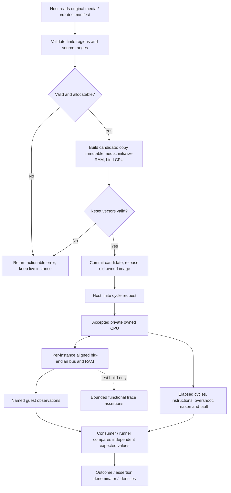

# Phase 02: Executable diagnostic SDK - Research

**Researched:** 2026-10-05
**Domain:** C17 native lifecycle, diagnostic bus/bootstrap, deterministic execution, CMake packages and local evidence
**Confidence:** MEDIUM

<user_constraints>
## User Constraints (from CONTEXT.md)

<!-- DATA_7ab19ce2_START -->
### Locked Decisions

The user instructed: “follow ur recs for all these plz.” This accepts the recommendations summarized here; downstream planning may choose concrete names and internal structure but must surface any material deviation from these behavior and evidence contracts.

### Native instance, media ownership, lifecycle and failure guarantees

- **P02-C-01:** Use an opaque per-instance native C API. Accept a documented, bounded region/manifest input backed by immutable source bytes. Validate sizes, arithmetic, and region bounds before allocating; copy successful input into instance-owned normalized storage so the consumer can release its source buffer after load.
- **P02-C-02:** Commit load transactionally. A rejected manifest, allocation failure, or failed replacement must leave a previously usable instance and its loaded media unchanged. Keep reset distinct from unload: reset restarts the guest from the loaded media, unload explicitly releases media, and destroy releases all instance-owned memory.
- **P02-C-03:** Initially use standard C allocation in the public API. Exercise allocation-failure behavior through private/test-only fault injection; do not add a public allocator callback contract unless a concrete integrator requirement justifies the extra lifetime and callback surface.
- **P02-C-04:** Keep calls on one instance non-overlapping/non-reentrant; allow distinct instances to run concurrently. Keep host file, archive, device, wall-clock, network, and process services outside the native core.

### Deterministic bounded execution and public observations

- **P02-C-05:** Bound native execution by a finite guest-cycle request derived from the accepted Phase 01 timing contract. Return actual elapsed guest cycles, completed instruction count, instruction-boundary overshoot, explicit stop/error reason, and fault PC/instruction details where relevant. Do not use wall-clock time as guest progress or make a host-time timeout part of core semantics.
- **P02-C-06:** Report a guest `STOP` as an execution state/result, not success by itself. The diagnostic runner and consumer determine success from named expected guest results.
- **P02-C-07:** Expose only bounded run information and the diagnostic's named guest-visible observations through the ordinary API. Keep complete CPU registers, private continuation records, and unrestricted bus histories out of the public API. Use a bounded private test/runner trace for the functional bus assertions required by the diagnostic contract.
- **P02-C-08:** Do not expose a public snapshot, replay, persistence, or CPU plugin contract in this phase. Any private state/test seam remains distinct from the SDK ABI and durable formats.

### Original diagnostic, functional bus observation, and independent oracle

- **P02-C-09:** Run the same original, redistributable, firmware-free CPU/bus diagnostic through both the ordinary native API and the headless runner. Extend the evidence to cover initialized data and BSS, guest-computed CPU results, and named, bounded functional bus observations; derive exact fixture contents and outputs during research from the accepted backend contract.
- **P02-C-10:** Derive expected CPU behavior from the original fixture recipe and Motorola/NXP M68000 primary manuals. Other emulator outputs may help locate disagreements, but their ancestry must be recorded and they cannot serve as the hardware oracle. The manuals establish CPU behavior, not Neo Geo board behavior.
- **P02-C-11:** Keep a named wrong-behavior mutation control for each consequential diagnostic claim. It must fail the intended assertion; crashes, timeouts, unrelated failures, nonzero exit alone, and zero executed assertions do not count as a passing negative control.
- **P02-C-12:** Record rights/notices, source and generation recipe, exact fixture/output digest, firmware needs, tool/configuration identities, oracle ancestry, and executed assertion counts. Publish only the original lawful fixture; no commercial ROM, BIOS, or private corpus.

### Shift-left evidence, package consumers, automation, and cost

- **P02-C-13:** Map each observable requirement to its earliest useful automated check in the plan and SUMMARY coverage. Keep one reproducible CTest-backed local verification entrypoint with focused suites and visible denominators; do not create a second testing framework or one opaque all-purpose test.
- **P02-C-14:** Cover bounds, invalid media/lifecycle/error recovery, allocation failure, expected-result integer boundaries, negative controls, repeat/split execution at equal guest boundaries, distinguishable interleaved and concurrent instances, and concurrent cold create/load/teardown. Retain each discovered defect as a deterministic regression.
- **P02-C-15:** Use bounded fuzz targets only for hostile media and public call sequences. Preserve and minimize failures, then promote them to deterministic regressions. Run supported ASan/UBSan and concurrency sanitizer configurations where available; pair UBSan with expected-result boundary cases. Report unsupported sanitizer/toolchain lanes explicitly. Do not let sanitizer or fuzz axes multiply into an unmeasured CI matrix.
- **P02-C-16:** Build and run real out-of-tree installed C consumers against static and shared libraries, and compile/link a C++ consumer of the public headers. Compiled examples and ownership/error/failure-reproduction docs must match the actual installed artifacts. CMake packages must work from relocated prefixes; offline source consumption must not download dependencies at configure time.
- **P02-C-17:** Produce machine-readable pass/fail/skipped/unsupported/unknown outcomes with exact source/dependency/build/configuration/input/fixture/oracle identities and nonzero executed assertions. Record named-host diagnostic execution, memory/allocation, load, and build-cost baselines with workload identity and uncertainty; do not enforce uncalibrated thresholds or claim gameplay performance.
- **P02-C-18:** Keep hosted required CI, branch protection, unattended PR/App behavior, release automation, and published artifact qualification in Phase 03. When hosted CI is introduced, reuse the local verification entrypoint and check parity. Do not claim Phase 03 authority or support-matrix qualification from local Phase 02 checks.

### the agent's Discretion

- Choose concrete function/type names, enum values, manifest encoding, result-record schema, test-suite names, bounded fuzz duration, and test-only allocation-failure injection technique. Keep these choices C17, compact, documented, measurable, offline, and compatible with decisions P02-C-01–P02-C-18.
- Choose a C-native fuzz engine supported by the actual qualified toolchain. LLVM libFuzzer is an optional compiler-matched development tool, not a runtime dependency or a required portable consumer tool.
- Reuse the existing original fixture as a starting point only after the Phase 01 gate passes and after Phase 02 adds the required initialized-data/BSS observations. Do not treat the private candidate's test hooks as public behavior.

### Deferred Ideas (OUT OF SCOPE)

- Commercial ROM/BIOS import, game compatibility, original-BIOS boot, video/audio, GUI, and full Neo Geo hardware claims remain outside this SDK phase.
- Public CPU/plugin ABI, snapshots, replay compatibility, durable saves, and frontend/libretro or Playstead integration remain deferred to later scopes.
- Hosted CI authority, protected PRs, App/bot event qualification, release staging/publication, and complete artifact qualification belong to Phase 03.
- The original-silicon saved-PC question remains unknown and excluded from the accepted candidate scope; it does not block this Phase 02 SDK plan.
<!-- DATA_7ab19ce2_END -->
</user_constraints>

## Project Constraints (from AGENTS.md)

The following is the project's actionable instruction set, reproduced verbatim to keep the planner's compliance check complete. These are project instructions, not claims of implemented behavior.

<!-- DATA_b17f46d9_START -->
# Glueyneo working rules

Glueyneo is a portable C Neo Geo MVS/AES emulation core in the v0.1 CPU/bus diagnostic SDK milestone. Phase 01 accepted the owned C17 backend for its bounded diagnostic subset; no public SDK or broad hardware/platform compatibility is qualified yet. Begin with .planning/PROJECT.md and STATE.md, then read REQUIREMENTS.md and ROADMAP.md as appropriate. Use .planning/preparation/README.md to find dated evidence and DECISIONS.md for decision provenance; current canonical documents own active scope. Do not treat proposed designs or historical sibling-project receipts as implemented behavior.

## Engineering

- Keep runtime code and selected runtime dependencies in C. C17, target-based CMake, CTest and a small pinned Unity dependency are initial defaults; prove actual platform support.
- Keep the native core independent of frontend, filesystem, audio device, graphics API, network, secrets and wall clock. Use opaque per-instance state and explicit ownership, buffers, errors and deterministic time.
- Audit reused CPU/audio code for every mutable global, callback, initialization race and state field. A context API alone does not establish reentrancy. Keep third-party changes small, pinned, licensed and documented.
- Prefer small, flat dependency trees. For small, understandable functionality, another audited copy or local implementation can be better than another dependency. Add a dependency when its concrete correctness or maintenance value justifies its full transitive tree; retain licenses, provenance and an update/ownership plan for copied code too.
- Prefer simple concrete modules, defined integer behavior, explicit byte order and checked resource limits. Hardware comments should explain evidence and timing. Avoid speculative frameworks and optimizations without representative profiles.
- Distinguish emulated hardware time from host pacing. Preserve original hardware behavior, including slowdown, unless an option explicitly describes a deviation.
- Keep durable saves, emulator snapshots, replay compatibility and public ABI versions separate. Test actual continuation and instance isolation before making those claims.

## Evidence and documentation

- Use primary sources where available. Record exact references, revision/date, supported claim, uncertainty and test-oracle ancestry. A reference emulator's output is not automatically hardware truth.
- Pair a behavioral change with appropriate automated evidence and documentation in the same PR. Use compiled examples, real consumer tests, meaningful boundary tests, properties and fuzz regressions. Keep test cost proportional to fault value.
- Record unsupported/skipped/unknown outcomes explicitly. Do not update goldens, relax budgets or rerun away failures merely to get green CI. Explain intentional baseline changes.
- Keep release and performance claims tied to exact code, dependency, configuration and input identities. Proposed numbers remain targets until measured.
- Keep one current contract per topic. Preserve dated preparation as provenance with supersession links. Update stale instructions and examples when behavior changes.

## Delivery and autonomy

- Use OpenGSD @opengsd/gsd-core and its installed workflow/schema. Preserve .planning/preparation during initialization. Keep a detailed current milestone, outlined next milestone and revisable longer horizon.
- Pause between named GSD workflow steps, including initialization, discuss, plan, execute, verify and shipping, and before advancing to another phase or milestone. Summarize the result and proposed next step, then let the user continue and change models. Do not auto-chain steps unless explicitly authorized for that run.
- At each GSD workflow boundary, identify the exact phase and plan just completed, state whether the phase itself is complete, and give the concrete next GSD command derived from current state and verification. Prefer that command over a generic router when the destination is known; do not start the next step before the user continues.
- Apply .planning/METHODOLOGY.md to each discussion and substantive decision: adapt the user's breadth/depth role analysis, adversarial review and synthesized recommendations to the actual project context.
- The user authorizes subagent work, routine PRs, qualifying merges and automated releases within the selected step. Use clear file ownership and integrate independent work without reverting others. Follow through within that step without repeated approval requests for already authorized actions; respect the workflow pauses above.
- Prefer branches and PRs, protected green main, current-revision checks and an independent review pass. Triage relevant open issues/PRs at milestone start and shipping. Do not bypass protections or treat stale green checks as approval.
- Automate repeatable verification and release tasks within the authorized workflow step. In addition to the user's workflow/model checkpoints, surface unavailable credentials/account decisions or physical evidence that actually requires human involvement. Keep the unverified claim narrow and continue independent work within the approved step.
- Keep CI small and reliable. Measure critical path and runner-minutes, remove duplicate preparation, bound parallelism by memory, and cache only when it helps. Retain cold builds and fail-safe change classification.
- Bind releases to tested commits and artifacts. Stage complete releases before publication; verify token/event behavior. Keep untrusted PR execution separate from signing/publishing authority.

## Public repository hygiene

- Original Glueyneo work uses MIT. Preserve imported licenses/notices and audit each dependency and fixture at an immutable revision. No game/BIOS redistribution without an established right.
- Keep commercial ROMs, BIOS, private save states/captures and private test outputs outside Git and public CI. A hash identifies bytes; it does not establish redistribution permission.
- The library requires no secrets. Explicit local automation may use ignored .env.local; use GitHub Actions secrets for CI credentials and configuration variables for nonsecrets. Never print secret values or dump environments.
- Do not publish personal absolute paths, private emails, machine identifiers or private repository/account URLs. Check staged files, commit identity, generated docs, debug paths, archives and logs before public publication. Use an established public/noreply identity.
- Other projects used as research evidence are read-only unless the user separately requests changes there.

These rules capture project preferences, not an assertion that the proposed tooling, tests or automation already exists. Respect applicable runtime permissions and higher-priority instructions.
<!-- DATA_b17f46d9_END -->

## Summary

Use a compact instance/lifecycle and diagnostic-memory layer around the accepted owned backend; keep the frozen experiment sources and receipts intact. The Phase 02 context admits the bounded Phase 01 result while retaining the historical receipt and stale administrative-router caveat. The root build currently selects private experiments: source text `project(Glueyneo LANGUAGES C)`, `option(GLUEYNEO_CPU_EXPERIMENT "Build the private CPU acceptance experiment" OFF)`, and `option(GLUEYNEO_OWNED_CPU_EXPERIMENT "Build the private owned MC68000 experiment" OFF)`. The SDK target and installed consumer therefore require new build integration rather than renaming the experimental target. [VERIFIED: CMakeLists.txt:1-15] [VERIFIED: .planning/phases/02-executable-diagnostic-sdk/02-CONTEXT.md, Phase Boundary]

The existing fixture computes and stores arithmetic, but Phase 02 must add initialized RAM and zero-filled RAM observations. The backend already implements absolute-long word reads, so a small original extension can cover these obligations without changing the accepted opcode subset. A concrete proposed recipe appears below; its outputs are derived expectations awaiting execution, not acceptance evidence. [VERIFIED: tests/cpu/guest_fixture.c:4-9, quoted below] [VERIFIED: experiments/owned_cpu/cpu.c:438-475, quoted below] [ASSUMED: A1]

Keep one CTest-backed local entrypoint, focused Unity suites, two installed C consumer variants, a C++ linkage consumer, independent negative controls, and explicit result denominators. Keep relocation readiness in Phase 02 under P02-C-16; exhaustive inaccessible-original-location/source-archive and publication qualification remains Phase 03's BUILD-03/04 boundary. The local tool audit found usable sanitizer startup but a missing AppleClang libFuzzer archive. [VERIFIED: .planning/phases/02-executable-diagnostic-sdk/02-CONTEXT.md, P02-C-13–18] [VERIFIED: .planning/ROADMAP.md, Phase 2/3 requirements] [VERIFIED: 2026-10-05 compiler probes, output below]

**Primary recommendation:** Deliver the public create/load/reset/run/observations/unload/destroy path and original diagnostic first, then install consumers, hostile-boundary evidence and reproducible reporting; attach the earliest useful checks and integrator documentation to each slice. This implements P02-C-01–18.

## Architectural Responsibility Map

This table is a proposed responsibility assignment within the locked host/core boundary.

| Capability | Primary Tier | Secondary Tier | Rationale |
|---|---|---|---|
| Source files, file reading, CLI parsing, host measurements | Host runner / consumer | Local tooling | Host services stay outside native runtime |
| Validate normalized regions, copy bytes, transactional replace | Native API / ownership | Diagnostic memory | Load owns validation and atomic publication |
| Reset RAM bootstrap, bounded execution, errors | Native instance | Private owned CPU | The instance binds one private machine and CPU |
| Big-endian aligned transfers and named observations | Diagnostic memory / bus | Private CPU | Memory validates transfers; CPU requests effects |
| Expected outcomes and oracle decisions | Independent test / runner | Public API observations | Expected values come from recipe/manual, not execution code |
| Installation, relocation and linkage | Build/package tooling | Real consumer process | Export metadata and runtime loading both need evidence |
| Outcomes, identities and cost | Local evidence collector | CTest/runner | Guest cycles and host measurement remain separate |

[VERIFIED: .planning/phases/02-executable-diagnostic-sdk/02-CONTEXT.md, P02-C-01–18]

<phase_requirements>
## Phase Requirements

Descriptions below copy the requirement predicates from the canonical requirements. [VERIFIED: .planning/REQUIREMENTS.md, Native API through Documentation and Delivery]

| ID | Description | Research Support |
|---|---|---|
| API-01 | A C integrator can create, reset and destroy an opaque instance under documented ownership/allocation/lifecycle rules without requiring filesystem, device, network, wall-clock or process-global machine services. | Lifecycle state machine; private owned bindings; cold isolation |
| API-02 | A C integrator can load the documented diagnostic region/manifest representation with explicit immutable-media lifetime, checked sizes/arithmetic and finite resource limits. | Region descriptor proposal; validate-before-allocate; copy-on-load |
| API-03 | A C integrator can request bounded execution and obtain actual progress, stop reason and diagnostic observations through the ordinary native API under the qualified timing contract. | Preserve backend event accounting and named mailbox outputs |
| API-04 | A C integrator receives actionable errors for invalid sizes, unsupported capabilities, lifecycle misuse and allocation/load failures, and can safely recover or destroy the instance without leaks, process exit or unintended live-state mutation. | Transactional replacement; allocation sweep; output/error rules |
| DIAG-01 | An external C consumer executes an original redistributable CPU/bus guest program through the ordinary create/load/run/results/destroy path and checks meaningful guest-computed observations. | Extended original guest and installed consumer |
| DIAG-02 | A maintainer can run a headless diagnostic runner through the ordinary native API and reproduce the diagnostic bootstrap, initialized-data/BSS and named CPU/bus assertions using documented oracle ancestry, with a deliberate wrong-behavior control that fails the checks. | Concrete recipe; private bounded trace; consequential controls |
| DIAG-03 | A maintainer can repeat and split the supported execution workload and run distinguishable native diagnostic instances both interleaved and concurrently while matching isolated-baseline guest observations at equal execution boundaries, including concurrent native creation/load/teardown paths. | Equal-boundary schedule and distinguishable fixtures |
| BUILD-01 | An integrator can build the C17 static and shared runtime from an offline source tree with target-scoped CMake, CTest and pinned test-only Unity, without inherited developer flags or configure-time dependency downloads. | Retained Unity pin; private flags; separate static/shared builds |
| BUILD-02 | An out-of-tree C consumer can find and link an installed CMake package and execute the diagnostic against both static and shared library variants; a C++ consumer can compile and link the public headers without changing the runtime language. | Target exports and independent C/C++ projects |
| EVID-01 | A maintainer can audit every public fixture and dependency from a manifest recording rights/notices, source revision, generation/build recipe, output digest, firmware needs and test-oracle ancestry. | Fixture recipe/rights ledger and runtime closure inventory |
| EVID-02 | A maintainer can run proportionate boundary and lifecycle tests, meaningful properties, bounded input/call-sequence fuzzing and supported sanitizer checks, with retained regressions for discovered failures. | Boundary matrix, allocation injection, fuzz and sanitizer audit |
| EVID-03 | A maintainer receives machine-readable results with exact code/dependency/configuration/input identities, nonzero executed assertions and distinct pass/fail/skipped/unsupported/unknown outcomes. | Fail-closed collector schema and denominator checks |
| EVID-04 | A maintainer can reproduce an initial diagnostic execution, memory/allocation, load and build-cost baseline on named host classes, retaining workload/output identity and uncertainty without presenting these measurements as gameplay performance or an enforced uncalibrated threshold. | Measurement protocol separate from core guest time |
| DOC-01 | A new integrator can follow a compiled getting-started example, ownership/lifetime/error guide and small failure reproduction procedure that match the shipped API and artifacts. | Installed compiled example and reproduction inputs |
| DOC-02 | An integrator can inspect the alpha's exact CPU/bus/bootstrap capability subset, timing limitations and unverified dimensions, including explicit absence of game, original-BIOS, video, audio and public snapshot/persistence compatibility claims. | Bounded capability table; WR-01 correction and oracle limitations |
</phase_requirements>

BUILD-03/04 and DEL-01–05 remain Phase 03 requirement owners. Phase 02 supplies relocation-ready exports and a local moved-prefix smoke result, not completed release/platform qualification. [VERIFIED: .planning/ROADMAP.md, Phase 2/3 requirement lists] [VERIFIED: .planning/phases/02-executable-diagnostic-sdk/02-CONTEXT.md, P02-C-16/18]

## Standard Stack

### Core

| Component | Version / identity | Purpose | Selection |
|---|---|---|---|
| Owned C runtime | C17 | API, memory/bus, accepted private CPU | Locked project language; no additional runtime dependency |
| CMake / CTest | Provisional minimum 3.20; observed 4.4.3 | Target build/install/export and test registration | Keep floor; current local version does not prove minimum execution |
| Standard C allocator | Toolchain C runtime | Instance and copied-media storage | Locked public allocation policy; private injection only |
| Ninja | Observed 1.13.2 | Developer build executor | Existing default; consumers may choose another generator |

Current floor source quote: `cmake_minimum_required(VERSION 3.20)`. [VERIFIED: CMakeLists.txt:1] Target C17 properties support required standard selection; floor availability and actual compiler support are distinct. [CITED: https://cmake.org/cmake/help/v3.20/prop_tgt/C_STANDARD.html] Local versions were observed with version commands on 2026-10-05. [VERIFIED: local tool audit]

### Supporting

| Component | Immutable identity | Purpose | Boundary |
|---|---|---|---|
| ThrowTheSwitch Unity | `b6763fbd9cedfacaa89e2ad9fd00d615a234e355` | Existing C assertions | Test-only copied subset; retain notice/digests |
| Python | Observed 3.14.4 | Existing local collection/control orchestration | Development tooling; no runtime or installed consumer requirement |
| ASan + UBSan | AppleClang-matched runtime, startup probe passed | Memory/undefined-behavior evidence | Owned development targets only |
| TSan | AppleClang-matched runtime, startup probe passed | Concurrent distinct-instance tests | Separate configuration |
| libFuzzer | Optional compiler-matched tool; local archive missing | Hostile manifest and call-sequence coverage | Never consumer/runtime dependency |

Unity source quote: `Pin: `b6763fbd9cedfacaa89e2ad9fd00d615a234e355`.` [VERIFIED: third_party/unity/PROVENANCE.md:3-7] Official pinned upstream inspected: [CITED: https://github.com/ThrowTheSwitch/Unity/tree/b6763fbd9cedfacaa89e2ad9fd00d615a234e355]. Reuse the existing pin; no version upgrade belongs to this phase. The pin's release label/date was not requalified, so do not substitute dated STACK.md's version claims.

### Alternatives Considered

| Recommended choice | Strongest alternative | Disposition |
|---|---|---|
| Typed in-memory region descriptors | JSON/archive/ELF parser in runtime | Reject added parser and filesystem surface for this diagnostic |
| One compact API instance | Public CPU structs/plugins | Deferred by P02-C-07/08 |
| Standard allocation, private injection | Public allocator callbacks | Rejected by P02-C-03 |
| Vendored existing Unity | Ceedling/CMock/property framework | Unnecessary tree for explicit C runners |
| Separate static/shared build directories | Simultaneous dual targets | Prefer fewer export-selection and duplicate compilation rules initially |

These are prescriptions within accepted discretion, not new dependencies or revised behavior. [VERIFIED: .planning/phases/02-executable-diagnostic-sdk/02-CONTEXT.md, Implementation Decisions]

**Installation:** No package install is required. Build from the retained offline tree. Do not add FetchContent acquisition, npx downloads or a new package manager step.

## Package Legitimacy Audit

Not applicable to registry packages: this research recommends no external package installation or new dependency. Retain the existing pinned, test-only Unity source and its recorded copied-file hashes/notices; package-registry checks do not authenticate vendored C commits. [VERIFIED: third_party/unity/PROVENANCE.md:3-14]

If execution selects an optional compiler distribution to obtain libFuzzer, record the official distribution source, immutable version, checksum and matching runtime identity before use. Do not install it opportunistically while configuring the SDK.

## Architecture Patterns

### System Architecture Diagram

Proposed data flow implementing the locked decisions:



### Component Responsibilities and Proposed Structure

All paths in this table are proposed allocations, not existing source paths. [ASSUMED: A2]

| Proposed area | Responsibility |
|---|---|
| `include/glueyneo/glueyneo.h` | Only public opaque API, bounded media and result declarations, C++ linkage guards |
| `src/instance.c`, `src/diagnostic_bus.c` | Ownership/lifecycle, transactional image, supported memory mappings, CPU translation |
| Existing accepted CPU source compiled privately | Preserve source bytes; build hook-free SDK closure without exporting private header |
| `tools/diagnostic/` | File/CLI handling and machine-readable runner results |
| `tests/sdk/`, `tests/consumers/` | Unity seam tests, independently configured installed consumers |
| `fixtures/diagnostic/`, `docs/` | Original recipe, bytes, rights/oracle manifest, compiled integration documentation |
| `cmake/`, `tools/verify_sdk.py` | Export templates and one local CTest-backed entrypoint |

Do not copy, move or rename frozen Phase 01 sources to create the SDK. Compile the accepted implementation into the runtime privately with test hooks disabled; audit exported symbols and linkage. If a genuine backend repair is discovered, preserve old receipts and create narrowly scoped new evidence rather than rewriting historical admission. This avoids a migration phase and keeps the backend provenance checkable.

### Pattern 1: Transactional image replacement

Use a separately allocated candidate image containing copied ROM, retained RAM initialization prefix, live RAM and CPU context. Validate every region before allocating. Bind CPU bus userdata to the image's stable address; never bind to an automatic stack struct or a candidate pointer that will move. Reset the candidate before publishing it. On failure, free candidate allocations and leave live image/CPU/RAM/observations untouched. On success, exchange image pointers and release the old image.

A RAM descriptor should distinguish initialized source length from mapped memory length: copy the prefix and zero the remaining RAM. Immutable initialization bytes must survive runs so reset can restore bootstrap RAM without borrowing the original consumer buffer. Reject duplicate/overlapping mappings and unsupported permissions/profiles. Validate reset-vector PC alignment and mapped instruction access, stack range needed by this diagnostic, region endpoints and total copied/live storage before commit. Document the stack's exclusive-upper-bound position.

Bounds pattern: after proving `offset <= capacity`, check `length <= capacity - offset` before access; check multiplication with division and additions before evaluation. Pointer-plus-length inputs require valid readable host storage; C cannot validate an arbitrary dangling/non-owned pointer. Promise checked lengths for contract-compliant pointers, not recovery from fabricated pointers. [ASSUMED: A3]

### Pattern 2: Lifecycle and errors

Document a small lifecycle: created/unloaded, loaded-ready, stopped, guest/host fault; destruction terminates ownership. Use explicit unload. Define reset as restarting loaded media, including restoring initialized RAM and zero-fill, rather than merely resetting registers. Avoid hidden reloads in run or observation queries.

Define zero-budget calls as no-work observations and ensure invalid requests preserve state. Define output behavior on error (initialize bounded error/result outputs consistently, never leave stale fields mistaken for progress). Make null-destroy/unload policy explicit. A freed non-null handle, double destroy, overlapping same-instance calls and races violating host ownership are caller violations rather than detectable recovery promises. Private allocation-failure injection should be per-test/per-instance and unavailable from installed headers or runtime exports.

No public callbacks are needed. Internal allocator/bus callbacks retain stable per-instance userdata. Separate API validation failures, unsupported guest capability, and execution states. Fault details must not expose host pointers, private paths or unrestricted history. [VERIFIED: .planning/phases/02-executable-diagnostic-sdk/02-CONTEXT.md, P02-C-01–08] [ASSUMED: A3]

### Pattern 3: Translate accepted timing, do not invent new progress

Private header quotes:
```c
#define OWNED_CPU_MAX_CYCLE_BUDGET UINT64_C(1000000)
typedef struct {
    owned_cpu_status reason;
    uint64_t requested_cycles;
    uint64_t elapsed_cycles;
    uint64_t overshoot_cycles;
    uint64_t instructions;
    uint32_t pc;
    uint32_t fault_pc;
    uint16_t instruction_register;
} owned_cpu_run_result;
```
[VERIFIED: experiments/owned_cpu/cpu.h:9,39-48]

Run returns completed dispatches and elapsed event charges; whole reset recovery can exceed a small request, and stopped execution can consume idle cycles. Exact source quotes: `result.elapsed_cycles = UINT64_C(40);`, `uint64_t idle = cycle_budget - result.elapsed_cycles;`, `result.reason = OWNED_CPU_STOPPED;`, `result.reason = cpu->stopped != 0u ? OWNED_CPU_STOPPED : OWNED_CPU_BUDGET;`. [VERIFIED: experiments/owned_cpu/cpu.c:657-665,694-704,719-731]

Keep these semantics visible in the public mapping. In particular, a large request reaching STOP may include idle time after the last instruction; do not claim that returned elapsed time always equals the recipe's instruction total. Test zero, event-boundary, undersized, maximum and excessive requests; preserve unsupported/fault status distinctly. Compare split runs at matched boundaries, summing actual elapsed/instruction counts and accounting for per-call overshoot. Arbitrary partitions of requested budgets need not end at the same boundary.

Keep public named observations as copies of known guest mailbox values, not privileged register snapshots or host-computed success. Runner success requires assertions on those values and progress, not STOP alone. [VERIFIED: .planning/phases/02-executable-diagnostic-sdk/02-CONTEXT.md, P02-C-05–08]

### Pattern 4: Installed CMake consumption

Use target include directories with separate build/install interfaces, relative GNUInstallDirs destinations, target export namespace, and a generated package config that includes its colocated target export. Export only public runtime usage requirements. Static build selection belongs to a separate prefix/build from shared selection. Use C++ only in the separate consumer project's language selection.

CMake 3.20 documents `configure_package_config_file` relocation support and warns against hard-coded dependency paths. It distinguishes archive/library/runtime installation classes, including Windows import-library versus DLL destinations. Use documented floor-compatible commands; do not adopt header FILE_SET syntax from newer examples. [CITED: https://cmake.org/cmake/help/v3.20/module/CMakePackageConfigHelpers.html] [CITED: https://cmake.org/cmake/help/v3.20/manual/cmake-packages.7.html] [CITED: https://cmake.org/cmake/help/v3.20/command/install.html]

Test package discovery, include compilation, link and actual process execution independently. A shared consumer must resolve the installed relocated library at runtime. Check macOS install names/rpaths and shared export visibility on the exercised toolchain; BUILD_INTERFACE working alone proves neither. Prevent the consumer from silently linking the in-tree archive. Inspect compile/link commands and loader dependencies. Add moved-prefix smoke evidence in Phase 02; full artifact isolation and release archives remain Phase 03.

### Anti-Patterns to Avoid

- Publishing the experimental CPU header, state record or callbacks as the SDK contract violates P02-C-03/07/08.
- Calling reset on the live CPU before successful replacement commits violates P02-C-02.
- Storing source buffer addresses or candidate stack addresses violates P02-C-01/04.
- Returning host-computed “diagnostic passed” without guest mailboxes violates P02-C-06/09.
- Treating arbitrary split requests as equal guest boundaries misstates P02-C-05/14.
- Installing Unity, private backend headers or test hooks into the SDK expands the dependency/ABI surface.
- Adding hosted authority or release automation in this phase crosses P02-C-18.

## Original Diagnostic and Oracle

### Source facts retained

Original fixture quote:
```c
const uint8_t program[]={0x70,7,0x56,0x80,0x23,0xc0,0,0,0x10,0,0x4e,0x72,0x27,0};
memset(rom,0,512); rom[2]=0x20; rom[6]=1;
memcpy(rom+0x100,program,sizeof(program));
if(scenario) {rom[0x101]=11; rom[0x102]=0x5a; rom[0x109]=4;}
if(mutate) rom[0x101]++;
```
[VERIFIED: tests/cpu/guest_fixture.c:5-9]

Supported absolute-word-load source quotes:
`(*opcode & UINT16_C(0xf1ff)) == UINT16_C(0x3039)`;
`cpu->data_registers[reg] = (cpu->data_registers[reg] & UINT32_C(0xffff0000)) | value;`;
`*cycles = UINT64_C(16);`.
[VERIFIED: experiments/owned_cpu/cpu.c:438,470-475]

The primary manuals describe MOVE word register behavior, MOVEQ sign extension, ADDQ and STOP; the user manual's MC68000 timing tables apply to these instruction forms. Cite PRM printed pp.4-11–12,4-116–117,4-134 and6-85; UM Tables8-2/3/5/12/14 and reset §6.3.1. These establish CPU architectural expectations; the functional callback order remains this project's explicitly bounded implementation contract. [CITED: https://www.nxp.com/docs/en/reference-manual/M68000PRM.pdf] [CITED: https://www.nxp.com/docs/en/reference-manual/MC68000UM.pdf]

### Concrete proposed fixture

This is a derived original recipe, not an executed or committed fixture. All new addresses, words, output values and schedule totals in this subsection are [ASSUMED: A1]. Validate decoding independently against the manuals and then run through the ordinary SDK. No assembler dependency is necessary for a small reviewed word-array recipe.

Use a 512-byte ROM at guest zero and a 4096-byte RAM region starting at 0x1000. Reset vectors choose SSP0x2000 and PC0x100. Supply a ten-byte RAM initialization prefix with the data word at offset8; RAM after that prefix is zero-filled. Thus the BSS word at0x100a is outside the initialized prefix. Avoid relying on unspecified reset register contents: explicitly clear the registers before word loads.

| Guest address | Instruction words | Expected operation |
|---|---|---|
| 0x100 | 7007 5680 23c0 0000 1000 | A:7+3, store long10 at0x1000 |
| 0x10a | 7200 3239 0000 1008 5681 23c1 0000 1004 | Clear D1; load initialized word0x1234; add3; store long0x1237 at0x1004 |
| 0x11a | 7400 3439 0000 100a 5282 23c2 0000 1010 | Clear D2; read BSS zero; add1; store long1 at0x1010 |
| 0x12a | 4e72 2700 | STOP; final boundary PC0x12e |

Scenario B changes the first computation to11+5=16 and the initialized word to0x2345, yielding0x2348. Use the same guest program topology and named outputs so contamination is distinguishable across instances. Expected completed instructions:12. Proposed instruction cycles:132, derived as32+48+48+4; reset recovery40 yields172 at the terminal instruction boundary. Proposed split cumulative boundaries are40,44,52,72,76,92,100,120,124,140,148,168,172. Assert actual elapsed work rather than stopping merely on a requested total.

Named public outputs should include arithmetic result, initialized-data-derived result and BSS-derived result, plus bounded run counters/reason. Public observations must not provide a generic arbitrary-memory/CPU-register debugger. Internal bus assertions should name reset-vector reads, initialized-word read, BSS read, and high-word-before-low-word stores. Bound trace capacity and fail explicitly on overflow; truncation cannot count as a complete order assertion.

### Consequential controls and ancestry

Provide separate named controls for arithmetic corruption, wrong initialized prefix, nonzero BSS, byte-order/store-order corruption, missing progress and split/owner contamination. Each control must reach and fail its intended assertion with a nonzero known denominator. Prefer the same assertion function with a private mutation switch or altered lawful fixture, supervised by the local collector. Reject unrelated failures, signal termination, timeout and zero assertions. [VERIFIED: .planning/phases/02-executable-diagnostic-sdk/02-CONTEXT.md, P02-C-09–14]

Record CPU result ancestry as original recipe + Motorola manuals; record trace ancestry as source-defined functional ordering + independent test expectation. Isolation baselines establish ownership equivalence, not independent CPU correctness. Preserve firmware-free/MIT evidence for every new source and generated binary. Digest exact byte arrays, expected observations and recipe; never regenerate a golden from a failing runtime. [VERIFIED: .planning/phases/02-executable-diagnostic-sdk/02-CONTEXT.md, P02-C-10–12]

WR-01 must not propagate: current Phase 01 verification corrects old prose about a user-mode MOVE-to-SR extension fetch. Cite the correction rather than editing frozen source-bound historical ORACLE/ACCEPTANCE files. [VERIFIED: .planning/phases/01-cpu-acceptance-experiment/01-VERIFICATION.md, Warnings, Unknowns and Anti-Patterns]

## Don't Hand-Roll

| Problem | Don't build | Use instead | Why |
|---|---|---|---|
| Assertions/test runner ecosystem | Second framework | Existing pinned Unity + CTest | Locked small testing stack |
| Package discovery/relocation | Hard-coded include/link path scripts | CMake exported targets/config helpers | Floor-supported standard mechanism |
| CPU execution | New dispatcher/emulator dependency | Accepted owned backend privately | Gate already passed for bounded subset |
| Heap/race detection | Custom allocator debugger | Sanitizer lanes plus small private failure injection | Instrumentation complements meaningful assertions |
| Fixture format | Archive/ELF/JSON runtime parser | Typed bounded descriptors + original bytes | Only small normalized diagnostic representation needed |
| Security cryptography | Hash implementation inside core | Existing host tooling for evidence digests | Library has no crypto/secret requirement |

[VERIFIED: .planning/phases/02-executable-diagnostic-sdk/02-CONTEXT.md, P02-C-01–18] [CITED: https://cmake.org/cmake/help/v3.20/manual/cmake-packages.7.html]

**Key insight:** The understandable local memory mapper and lifecycle are justified original code. Reuse mature build/test/instrumentation mechanisms without adding general emulator, parser or callback frameworks.

## Common Pitfalls

### 1. Reset/load destroys recoverable live state

**What goes wrong:** A failed candidate allocation or invalid reset vector corrupts a working instance.
**Why:** Validation/reset happens against the live image.
**Avoid:** Candidate image commit after complete validation/reset; sweep every allocation index while another instance runs.
**Warning signs:** Failure tests only cover first load; previous media digest/RAM/progress not compared.
[VERIFIED: .planning/phases/02-executable-diagnostic-sdk/02-CONTEXT.md, P02-C-02/14]

### 2. Copy-on-load holds a hidden borrowed seed

**What goes wrong:** Run works until source release, or reset reads freed initialization storage.
**Why:** Only ROM was copied; RAM prefix/manifest pointers stayed borrowed.
**Avoid:** Free/overwrite all source buffers immediately after load, then run/reset/repeat. Store initialization bytes separately from mutable RAM.
[VERIFIED: .planning/phases/02-executable-diagnostic-sdk/02-CONTEXT.md, P02-C-01/02]

### 3. STOP or sanitizer silence becomes a false pass

**What goes wrong:** A wrong mailbox or zero-instruction run appears successful.
**Why:** Collector recognizes process exit/stop only.
**Avoid:** Known named expected values, positive instruction/assertion counts, exact control failure checks, and fail-closed missing-results behavior.
[VERIFIED: .planning/phases/02-executable-diagnostic-sdk/02-CONTEXT.md, P02-C-06/11/17]

### 4. UBSan substitutes for architecture-result checks

Default undefined instrumentation excludes unsigned-overflow checks. Deliberate unsigned wrapping and accidental host size wrapping need different policies. Pair architectural integer boundaries with exact result assertions; precheck host lengths. [CITED: https://clang.llvm.org/docs/UndefinedBehaviorSanitizer.html]

### 5. Same-process warmed tests miss global/cold defects

Use a fresh process with synchronized worker creation/load/run/teardown and distinguishable data, then a separate TSan lane. Keep any global Unity bookkeeping out of worker threads: workers collect observations and the main thread asserts after join. No compulsory core threads or serialization lock. [VERIFIED: .planning/phases/02-executable-diagnostic-sdk/02-CONTEXT.md, P02-C-04/14/15]

### 6. Installed headers work only from the source tree

Use an independent consumer with only relocated prefix metadata and public headers. Inspect runtime loader dependencies and exported symbols. Keep warning/sanitizer flags and test dependencies private. [CITED: https://cmake.org/cmake/help/v3.20/manual/cmake-packages.7.html]

### 7. Historical contract validation reroutes current work

The frozen candidate checker records its pre-admission gate and no longer accepts post-admission canonical wording. Do not add it to a new SDK default aggregate, soften its predicate or restore stale Pending status. Preserve its historical reproduction instructions and run SDK/current documentation-route checks directly. Old administrative fingerprint drift is not new CPU evidence. [VERIFIED: .planning/phases/02-executable-diagnostic-sdk/02-CONTEXT.md, Phase Boundary]

## Code Examples

The examples are proposed patterns, not an existing public API. Identifier names, paths and literals are [ASSUMED: A2/A3]; retain their acceptance intent if planner naming changes.

### Checked source slice

```c
/* Proposed helper: readable source allocation is a caller precondition. */
static int valid_slice(size_t offset, size_t length, size_t capacity)
{
    return offset <= capacity && length <= capacity - offset;
}
```

### Stable candidate ownership

```c
/* Pseudocode. Build candidate privately; do not reset the live image. */
candidate = prepare_image(manifest, error);
if (candidate == NULL) return error;
old = instance->image;
instance->image = candidate;
release_image(old);
return success;
```

### Relocatable target metadata

Adapted pattern using floor-documented mechanisms; target/header/export names are proposals. [CITED: https://cmake.org/cmake/help/v3.20/manual/cmake-packages.7.html] [CITED: https://cmake.org/cmake/help/v3.20/command/install.html]

```cmake
include(GNUInstallDirs)
target_include_directories(glueyneo PUBLIC
  $<BUILD_INTERFACE:${CMAKE_CURRENT_SOURCE_DIR}/include>
  $<INSTALL_INTERFACE:${CMAKE_INSTALL_INCLUDEDIR}>)
set_target_properties(glueyneo PROPERTIES
  C_STANDARD 17 C_STANDARD_REQUIRED YES C_EXTENSIONS NO)
install(TARGETS glueyneo EXPORT GlueyneoTargets
  ARCHIVE DESTINATION ${CMAKE_INSTALL_LIBDIR}
  LIBRARY DESTINATION ${CMAKE_INSTALL_LIBDIR}
  RUNTIME DESTINATION ${CMAKE_INSTALL_BINDIR})
install(EXPORT GlueyneoTargets NAMESPACE Glueyneo::
  DESTINATION ${CMAKE_INSTALL_LIBDIR}/cmake/Glueyneo)
```

Also install only the public header and generated package/config-version files; this snippet is incomplete build integration, not a turnkey implemented package. Keep private CPU symbols hidden in shared builds; examine static global symbols and prevent collision when embedding.

## State of the Art

| Earlier project proposal / history | Current phase input | Impact |
|---|---|---|
| Musashi-first research | Bounded owned backend admitted | No engine substitution or re-adaptation |
| STACK.md CMake3.24 proposal | Provisional3.20 floor | Use floor-compatible exports/presets; qualification remains pending |
| Private allocator/state/observation hooks | Standard public allocation and bounded named observations | Keep backend/test API out of SDK |
| Preparation broad release/platform suggestions | Phase02 local SDK; Phase03 hosted qualification | No platform/release authority inference |

[VERIFIED: .planning/phases/02-executable-diagnostic-sdk/02-CONTEXT.md, Phase Boundary/Implementation Decisions] [VERIFIED: .planning/PROJECT.md, Constraints] [VERIFIED: .planning/research/STACK.md, Scope update]

## Environment Availability

Audit date2026-10-05. Tool probes establish only tool availability/startup, not SDK acceptance. [VERIFIED: local version commands and temporary compiler probes]

| Dependency | Available / observed identity | Required by | Fallback / action |
|---|---|---|---|
| CMake/CTest | Yes4.4.3 | Build/test/install | Exact3.20 execution still unknown |
| Ninja | Yes1.13.2 | Developer presets | Other consumer generator permitted |
| C/C++ compiler | AppleClang21.0.0, arm64 Darwin25.6.0; SDK26.5 | Runtime + linkage consumer | Other hosts untested |
| Python | Yes3.14.4 | Local collector | Not needed by installed ordinary C consumer |
| Vendored Unity | Existing pinned files | C assertions | No network acquisition |
| ASan/UBSan | Compile0/run0 trivial C probe | Boundary lane | Must run actual SDK suite during execution |
| TSan | Compile0/run0 trivial C probe | Concurrency lane | Actual threaded SDK lane still pending |
| libFuzzer | Link failed: matched archive missing | Optional fuzz engine | Compiler-matched maintained LLVM distribution or bounded local C mutation harness |

Actual failure, with personal installation prefix elided:
```text
fuzzer compile_exit 1
ld: library '<toolchain>/usr/lib/clang/21/lib/darwin/libclang_rt.fuzzer_osx.a' not found
clang: error: linker command failed with exit code 1 (use -v to see invocation)
```

Do not claim AppleClang never supports libFuzzer; this installed runtime is missing. The selected compiler's ASan/UBSan and TSan trivial probes both returned compile_exit0/run_exit0; no phase implementation suite was executed in this research.

**Missing dependencies with no fallback:** None blocking planning.
**Missing dependencies with fallback:** libFuzzer runtime. Implement finite seeded byte/call-sequence mutation in the existing C harness if a matched compiler is unavailable; report lower coverage and lack of coverage-guidance explicitly. Persist failing seed/input and minimize through deterministic reduction. [ASSUMED: A4]

## Validation Architecture

Enabled in project config; current source quote: `"nyquist_validation": true`. [VERIFIED: .planning/config.json, workflow]

### Test Framework

| Property | Current / proposed value |
|---|---|
| Framework | Existing pinned Unity and CTest; Python only supervises controls/collection |
| Current configuration | Experimental root/owned CPU CMake registration |
| Current focused command | `ctest --preset owned-debug -L owned-diagnostic --output-on-failure` |
| Proposed SDK quick command | `ctest --preset sdk-debug -L sdk-contract --output-on-failure` |
| Proposed full local entrypoint | `python3 tools/verify_sdk.py` driving explicit CTest suites/builds |

Current preset quote: `"name": "owned-debug"`; current test label quote: `LABELS "owned-cpu;owned-diagnostic"`. [VERIFIED: CMakePresets.json:5,11,17] [VERIFIED: experiments/owned_cpu/CMakeLists.txt:125-132]
All SDK labels/presets/commands below are proposals [ASSUMED: A2]. Planner must create them and keep quick per-task checks within30 seconds once measured; package/fuzz lanes can be separate bounded jobs.

### Phase Requirements → Test Map

| Req ID | Earliest check / behavior | Type | Proposed automated command | Exists? |
|---|---|---|---|---|
| API-01 | create/reset/unload/destroy, no ambient services, cold ownership | Unit + source closure | `ctest --preset sdk-debug -L sdk-lifecycle` | Wave0 |
| API-02 | size arithmetic, mappings, copy/free-source, finite storage | Boundary/unit | `ctest --preset sdk-debug -L sdk-media` | Wave0 |
| API-03 | progress/reason/overshoot/fault and bounded observations | API integration | `ctest --preset sdk-debug -L sdk-run` | Wave0 |
| API-04 | every alloc failure, failed replacement, recovery/destruction | Fault/property | `ctest --preset sdk-debug -L sdk-faults` | Wave0 |
| DIAG-01 | ordinary API guest result checks | Integration + installed C | `ctest --preset sdk-debug -L sdk-diagnostic` | Wave0 |
| DIAG-02 | data/BSS/bootstrap/named trace and consequential controls | Runner + control | `ctest --preset sdk-debug -L sdk-controls` | Wave0 |
| DIAG-03 | equal-boundary repeat/split, interleaved/concurrent/cold | Property/concurrency | `ctest --preset sdk-debug -L sdk-isolation` | Wave0 |
| BUILD-01 | offline static/shared closure, target-private flags | Build | `python3 tools/verify_sdk.py --suite build` | Wave0 |
| BUILD-02 | installed static/shared C execute; C++ linkage | Package integration | `python3 tools/verify_sdk.py --suite consumers` | Wave0 |
| EVID-01 | fixture/dependency manifest bytes/rights/recipe ancestry | Manifest/integrity | `ctest --preset sdk-debug -L sdk-provenance` | Wave0 |
| EVID-02 | meaningful boundaries, seeded fuzz, sanitizer actual suites | Boundary + fuzz | `python3 tools/verify_sdk.py --suite hostile` | Wave0 |
| EVID-03 | reject missing/zero/malformed results; identities/outcomes | Collector controls | `ctest --preset sdk-debug -L sdk-evidence` | Wave0 |
| EVID-04 | measured execution/load/alloc/build workload identities | Measurement smoke | `python3 tools/verify_sdk.py --suite baseline` | Wave0 |
| DOC-01 | compiled example; documented invalid-manifest reproduction | Consumer integration | `python3 tools/verify_sdk.py --suite docs` | Wave0 |
| DOC-02 | capability table matches statuses, timing and oracle exclusions | Contract/behavior | `ctest --preset sdk-debug -L sdk-capabilities` | Wave0 |

### Sampling Rate

- Per task: run its focused suite and consequential controls; record actual cases/assertions.
- Per wave: run relevant accumulated SDK suites and one local aggregate at exact source identity.
- Phase gate: local aggregate includes ordinary diagnostic, static/shared installed consumers, C++ linkage, named controls, isolation/cold/failure tests, supported sanitizer and bounded hostile-input outcomes.
- Avoid repeating unaffected historical lanes or constructing static/shared × all optimization × all sanitizer × every host Cartesian products.
- Evidence collector rejects missing child result, zero assertions, unexpected control failure, status/result mismatch and contaminated configuration identity. Zero-case optional lanes are unsupported/skipped, never pass.

[VERIFIED: .planning/phases/02-executable-diagnostic-sdk/02-CONTEXT.md, P02-C-11/13–18]

### Wave 0 Gaps

- Public SDK CMake target/header and public diagnostic instance fixture.
- Focused SDK Unity runners and CTest labels; separate public consumer test tree.
- Private per-instance allocation fault injection and bounded trace capture.
- A runner/evidence schema with stable assertion identifiers and identities.
- Local aggregate independent of obsolete Phase01 gate predicates.
- Compiler-matched libFuzzer availability or explicitly reported C mutation fallback.
- Compiled integrator example, capability/ownership/error documentation.

All are new phase deliverables; existing private CPU assertions remain reusable backend evidence, not substitutes for native API checks. [VERIFIED: CMakeLists.txt:1-15] [VERIFIED: .planning/phases/02-executable-diagnostic-sdk/02-CONTEXT.md, Existing Code Insights]

### Fault-model matrix for planner task actions

Use empty/one-short/exact/one-over region boundaries, disallowed overlap, unknown profile, integer near-limit lengths, unmapped/ROM writes, odd access, invalid/reset vectors, null-with-nonzero source length and lifecycle order errors. Sweep candidate allocations and compare complete prior public observations after each failed replacement. Test free-source reset, reset after guest fault, unload/reload and another instance progressing during failure.

Property cases compare isolated vs interleaved/concurrent observations and equal-boundary elapsed counters. The hostile call-sequence decoder must track valid handle ownership and must not fabricate dangling pointers, destroy the same allocation twice or race one instance merely to invoke host-contract undefined behavior. Bound input bytes, operations, live instances, total guest requests, trace storage and allocations before executing each input.

Keep two small harness entrypoints: media validation/load and public lifecycle/run sequences. Proposed bounded policy: a deterministic seed corpus and finite iteration count for quick checks; optional coverage-guided runs of60 seconds each with corpus/seed/tool identities for local waves. Calibration, not the chosen number, establishes cost. [ASSUMED: A4]

## Evidence and Cost Protocol

Proposed record fields: schema version, suite/case/assertion IDs, outcome, observed/expected fields, executed assertion count, command, source revision plus relevant-source digest and dirty-state indicator, compiler/SDK/OS/architecture, CMake configuration, runtime artifact digest, Unity pin/digest, fixture/recipe/expected-output digest and oracle references. Distinct outcomes are mandated by P02-C-17; concrete field names are delegated. [VERIFIED: .planning/phases/02-executable-diagnostic-sdk/02-CONTEXT.md, P02-C-12/17] [ASSUMED: A2]

Generate evidence after build from actual outputs. Record failures before targeted repair; do not rerun away failed attempts. Record failing mutation/crash artifacts locally with only original lawful inputs; minimize and retain a regression. Environment metadata must use public host classes and tool identities, never serial numbers, user directories, private emails or environment dumps.

Measure guest workload on a release build with output checks before/after measurement. Record cold and warm load/execute separately, repeat count, sample distribution/spread and timer resolution; keep full host measurement in the runner/tooling. Count allocations/requested bytes privately and identify whether memory means owned payload, allocator requests or measured process resident memory. Capture clean build time and local aggregate critical path and process/job time. Report no thresholds until calibrated, and no gameplay extrapolation. [VERIFIED: AGENTS.md, Evidence and documentation/Delivery/Public repository hygiene] [VERIFIED: .planning/phases/02-executable-diagnostic-sdk/02-CONTEXT.md, P02-C-17/18]

## Security Domain

Enabled: source quote `"security_enforcement": true`. [VERIFIED: .planning/config.json, workflow]
The threat surface is caller-supplied lengths/manifest contents, guest memory accesses and lifecycle sequences inside an embedding process; the library has no authentication/session/network role under P02-C-04. Apply STRIDE selectively rather than introducing a web-security stack.

### Applicable ASVS Categories

The template's V2–V6 names below are the ASVS4-era mapping, pinned here to4.0.3 for provenance. They must not be described as current ASVS5 chapter numbering or blanket ASVS certification. OWASP's current project page uses version-qualified requirement identifiers; ASVS4.0.3 V5 includes unmanaged-code bounds/integer controls, some above Level1. We adopt relevant fault controls because of the C surface, while retaining the configured L1/high-block review policy. [CITED: https://owasp.org/projects/asvs] [CITED: https://raw.githubusercontent.com/OWASP/ASVS/v4.0.3/4.0/en/0x13-V5-Validation-Sanitization-Encoding.md]

| ASVS4.0.3 category | Applies here | Control |
|---|---|---|
| V2 Authentication | No authenticated principals in selected core | Host responsibility; do not add authentication |
| V3 Session Management | No network sessions | Explicit opaque instance ownership |
| V4 Access Control | No service/user authorization role | Validate permitted diagnostic address regions and readonly/writable mapping |
| V5 Validation / unmanaged code | Yes | Bounded descriptors, checked arithmetic/byte access, constant format strings, hostile-input tests |
| V6 Stored Cryptography | No secret/crypto use in native core | Host evidence digests are integrity identifiers, not authenticity/rights proof |

Applicability judgments follow locked phase architecture rather than missing implementation metadata. [VERIFIED: .planning/phases/02-executable-diagnostic-sdk/02-CONTEXT.md, P02-C-01–08/12]

### Known Threat Patterns

| Pattern | STRIDE | Mitigation / acceptance |
|---|---|---|
| Overflowing media length or mapping endpoint | Tampering / denial of service | Preflight caps and subtraction-based checks; exact boundary vectors |
| Unmapped or ROM write; guest faults corrupt host | Tampering | Checked bus accesses and explicit error translation |
| Use-after-free/reset borrowing old source | Tampering / denial of service | Instance-owned immutable initialization storage; free-source regressions |
| OOM replacement corrupts prior image | Denial of service | Transactional candidate and exhaustive private failure injection |
| Shared mutable test/core allocation counters | Tampering | Per-instance ownership; concurrent cold harness and TSan |
| Diagnostic falsely reports pass with zero assertions | Repudiation / evidence integrity | Fail-closed counts/outcomes and consequential controls |
| Private paths leak in runner/evidence logs | Information disclosure | Public-safe host classes and relative paths; no environment dumps |

These are project-specific threat-model recommendations implementing P02-C-01–18, not claimed security findings or web certification.

## Assumptions Log

| ID | Assumed / proposed claim | Section | Risk and resolution |
|---|---|---|---|
| A1 | New diagnostic words, addresses,132/172-cycle totals,12 instructions, outputs and split boundaries are derived but unexecuted | Original Diagnostic | Decode/manual cross-check then actual public-path execution; correct recipe before freezing fixture identity |
| A2 | New file paths, API/record/target names, labels, presets and commands are proposals | Structure, code examples, validation/evidence | Planner may choose names; ensure each command exists and examples compile |
| A3 | Detailed caller pointer preconditions, null-handle/output policy and subtraction helper meet integrator needs | Lifecycle/code examples | Define docs and boundary checks; readable host storage remains caller obligation |
| A4 | Bounded seeded C mutation fallback and proposed60-second optional fuzz budget offer proportionate local coverage | Availability/validation | Measure coverage/cost, preserve limits and lower-coverage disclosure; optional matched compiler if useful |

These are implementation choices inside explicitly delegated discretion or unexecuted technical expectations. They require confirmation by planning/execution evidence; they do not reopen the18 locked decisions or add a user approval checkpoint.

## Open Questions

1. **Concrete API layouts/names and caps:** delegated to planner; choose compact explicit widths, bounded descriptor count/storage and a clear capability profile. Compile both C/C++ consumers before treating layouts as public contract.
2. **Exact CMake3.20/toolchain reach:** current4.4.3 docs/availability do not establish floor execution. Keep floor provisional and report untested combination; Phase03 owns complete qualification.
3. **libFuzzer toolchain:** local AppleClang link probe failed. Use bounded C fallback with explicit limitations, or select an official matched LLVM installation as a development-only task. This does not block the functional SDK slice.
4. **Fixture identity:** new recipe has not been built/run. Generate and freeze digests only after independent manual review, public-path checks and named mutation controls.
5. **Historical gate validator:** preserve old receipts; document its pre-admission reproduction scope and exclude it from current SDK aggregate. Current STATE/ROADMAP/context own routing.

## Sources

### Primary source files opened this session

- `AGENTS.md`; `.planning/PROJECT.md`, `STATE.md`, `REQUIREMENTS.md`, `ROADMAP.md`, `METHODOLOGY.md`, `config.json`; current Phase02 context.
- Phase01 context/verifier,01-29 summary/admission review; bounded private CPU contract/subset/acceptance/header/source and CMake; original fixture/oracles and diagnostic runner.
- Root CMake/presets and Unity provenance; preparation index/decisions and relevant C architecture, quality/cost and hardware reports; STACK/ARCHITECTURE/PITFALLS research.
- These supply current code facts or dated provenance as identified inline. Historical acceptance prose is superseded only by the explicit current phase authority; no receipt is rewritten.

### Official documentation, accessed2026-10-05

- [CMake3.20.6 package config helpers](https://cmake.org/cmake/help/v3.20/module/CMakePackageConfigHelpers.html), [packages](https://cmake.org/cmake/help/v3.20/manual/cmake-packages.7.html), [install](https://cmake.org/cmake/help/v3.20/command/install.html): relocatable target/config behavior at retained floor; docs are not execution.
- [CMake3.20.6 C_STANDARD](https://cmake.org/cmake/help/v3.20/prop_tgt/C_STANDARD.html), [CTest](https://cmake.org/cmake/help/v3.20/manual/ctest.1.html): target language/test selection; versioned baseline.
- [LLVM libFuzzer](https://llvm.org/docs/LibFuzzer.html): bounded runs, corpus, minimization; moving documentation, compiler-runtime matching still required.
- [Clang ASan](https://clang.llvm.org/docs/AddressSanitizer.html), [UBSan](https://clang.llvm.org/docs/UndefinedBehaviorSanitizer.html), [TSan](https://clang.llvm.org/docs/ThreadSanitizer.html): instrumented development lanes, check groups and platform caveats; current upstream docs do not guarantee Apple distribution contents.
- [NXP M68000PRM](https://www.nxp.com/docs/en/reference-manual/M68000PRM.pdf): Motorola manual1992, NXP catalog upload2000-07-01; instruction effects/encodings.
- [NXP MC68000UM](https://www.nxp.com/docs/en/reference-manual/MC68000UM.pdf): ninth-edition manual1993, Rev9.1 catalog date2006-01-25; reset and MC68000 section8 timing. Publication, upload and access dates are distinct. Neither manual proves Neo Geo board timing.
- [Pinned Unity upstream](https://github.com/ThrowTheSwitch/Unity/tree/b6763fbd9cedfacaa89e2ad9fd00d615a234e355): retained test-only dependency source; no new acquisition.
- [OWASP ASVS project](https://owasp.org/projects/asvs) and [ASVS4.0.3 V5](https://raw.githubusercontent.com/OWASP/ASVS/v4.0.3/4.0/en/0x13-V5-Validation-Sanitization-Encoding.md): versioned category applicability and unmanaged-code controls; no full certification claim.

### Research seam and confidence

The installed research-plan selected Context7 for CMake/LLVM and Jina for manual extraction. No Context7/Jina tools or ctx7 executable were exposed; official web search/open was the fallback. Confidence classifier returned LOW for webfetch even with verified, and MEDIUM for websearch with verified. Accordingly official documentation remains CITED/MEDIUM; source-read local definitions and actual tool outputs use VERIFIED provenance without inflating the overall research tier. Three digests were stored under the research-plan keys. Graphify is disabled and agent_skills is empty; no project skill directories were found by inventory. [VERIFIED: installed GSD query outputs and local inventory,2026-10-05]

## Metadata

**Confidence breakdown:**
- Standard stack: MEDIUM — locked choices and observed tools; exact minimum/platform qualification pending.
- Architecture: MEDIUM — bounded backend/source inspected, public wrapper and package not implemented.
- Pitfalls: MEDIUM — locked failure contracts and official docs; new fixture and host input surfaces need execution.
- Environment findings: observed version/startup/link outcomes only; no SDK acceptance implied.

**Research date:**2026-10-05
**Valid until:** Recheck moving tool docs/availability at execution; stable manual/locked decision references remain applicable until their scope changes.
**Scope limits:** No implementation edited; no Phase01 verifier/UAT replay, hosted CI, publication, private media or hardware measurement performed.

