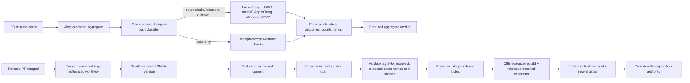

# Phase 03: Distributable release qualification - Research

**Researched:** 2026-10-06  
**Domain:** CMake SDK packaging, cross-platform CI, GitHub Actions authority, release staging, public-content/privacy evidence  
**Confidence:** HIGH for local architecture and published GitHub contracts; MEDIUM for unstable hosted behavior until exercised against the configured repository; LOW for any unrecorded external rights or authority.

<user_constraints>
## User Constraints (from CONTEXT.md)

### Locked Decisions

### Platform support and CI matrix
- **D-01:** Qualify Linux x64 with Clang and GCC, macOS arm64 with AppleClang, and Windows x64 with MSVC. Run core diagnostics and installed consumers on all three operating systems; run sanitizer and fuzz lanes on Linux Clang.
- **D-02:** Publish only exact exercised compiler, SDK, OS, architecture, configuration, and build identities. Expand the support claim when new evidence exists; do not infer a compatibility range from one green lane.
- **D-03:** Keep an always-started required aggregate and classify changes inside the workflow. Relevant source/build/package/release changes run the portability matrix; known documentation-only changes still run documentation/privacy checks; unknown paths run every lane. Do not use workflow-level path filters that can omit the required aggregate. Record actual lane/assertion counts, cold-build duration, critical path, and runner minutes.
- **D-04:** Implement Windows shared-export inspection so the consumer check proves the same public/private symbol contract on all supported platforms; an unsupported inspector must fail rather than silently skip.

### Trusted PR checks and merge authority
- **D-05:** Validate `pull_request` code with a read-only `GITHUB_TOKEN`, no secrets, and no write authority. Keep fork execution separated from trusted write/release jobs; retain GitHub's first-time contributor workflow-approval safeguard, then run read-only checks.
- **D-06:** Use protected main, strict current-revision required checks, independent review, and native auto-merge first. Add a merge queue only if merge contention demonstrates a need. Do not accept stale green checks or bypass protection.
- **D-07:** Run a separate GSD code review for every exact PR SHA. Keep merge blocked until each review finding is fixed or receives an evidence-backed disposition and the current SHA has a passing review.
- **D-08:** Use a narrowly permissioned GitHub App installation token for trusted write jobs. Qualify actual App/token event behavior, rules, and repository authority before claiming unattended operation; local workflow validation is not proof of hosted authority.

### Release staging, recovery, and publication
- **D-09:** Use the root `.release-please-manifest.json` version as the single source of truth and have CMake/package metadata read it at configure time; do not maintain a second manually synchronized version. Pin and qualify the selected release-please configuration/schema before implementation.
- **D-10:** Build and test the exact versioned commit. Stage an offline-rebuildable source archive and complete unsigned SDK archives for each tested OS/architecture. Include the installed library variants, public headers, CMake package files, diagnostic runner and fixture, notices, README, artifact manifest, and SHA-256 digests as applicable to each package.
- **D-11:** Serialize release work and make retries idempotent. On retry, inspect an existing draft even when release-please reports no newly created release; resume only if tag target, version/manifest, expected asset set, and digests match. Reject missing, unexpected, or mismatched content. Do not depend on a tag/release event emitted by a `GITHUB_TOKEN`-initiated draft flow; use explicit same-workflow job dependencies.
- **D-12:** Before publication, download the staged artifacts, verify their expected digests, rebuild the source archive offline, relocate the installed package away from source/build/install paths, and execute its real diagnostic consumer. Publish automatically only after these gates pass, using trusted App authority. Keep signing and notarization out of this unsigned SDK scope.

### Public-content, privacy, and licensing gate
- **D-13:** Start with a small Python standard-library scanner, not a new dependency. Scan the proposed public source/content, commit identities and metadata in the publishable history, captured CI logs, and bounded release archives. Check required notices/provenance; detect personal paths, private identity, machine identifiers, and secret patterns; and reject unallowlisted media or corpus files against an explicit inventory of permitted fixtures/dependencies.
- **D-14:** Fail closed on unreadable inputs, archive traversal/links, or configured size/count limits; avoid printing matched secret values; test detector rules with synthetic canaries. Use hosted secret scanning/push protection as an additional backstop only when actually enabled. State detector limits and never present a clean scan as proof that every secret is absent.
- **D-15:** Rights remain evidence-based: require an established license/redistribution record for each shipped dependency and fixture. A content scan cannot establish legal permission; keep any unresolved rights question explicitly unknown and request only the specific external confirmation needed.

### the agent's Discretion
- Choose concrete action/compiler/CMake versions and immutable action pins based on current primary documentation and exercised runner images; record their exact identities.
- Select the Windows symbol-table utility and implement the expected-export comparison with parity to Linux/macOS.
- Design the conservative path classifier, matrix fan-out, workflow permissions, artifact manifest, and bounded archive inspection around the existing local verification entrypoint. Preserve a cold build and cap parallelism based on measured runner memory/cost.
- Keep the scanner and workflow support code narrow. Add a scanner dependency only if canary/history evidence exposes a material detection gap that the small implementation cannot address reliably.
- Use objective local, CI, package, and downloaded-artifact evidence to clear machine-observable acceptance. Hand off only unavailable repository/App authority, first-time fork workflow approval, unresolved redistribution rights, or other evidence that truly requires an external actor.

### Deferred Ideas (OUT OF SCOPE)

None — discussion stayed within Phase 03 scope.
</user_constraints>

## Summary

Phase 03 should extend the current local SDK gate into a reproducible distribution and delivery path. Keep `python3 tools/verify_sdk.py` as the shared local/hosted verification seam, add a narrow fail-closed public-content/archive scanner, and use CI workflows as thin orchestration around exact identities and explicit outcomes. Current package installation already exports static/shared targets, public headers, diagnostic runner, fixture, license, and CMake package metadata. The current checks relocate and run real C/C++ consumers on supported local hosts; the package checker explicitly rejects Windows export inspection today. [VERIFIED: CMakeLists.txt:164-200] The project version is presently declared as `0.1.0` in the top-level CMake `project()` call, and presets currently use schema `2` with CMake floor `3.20`; D-09 requires replacing duplicate version ownership with manifest-derived configure-time metadata. [VERIFIED: CMakeLists.txt:1-2] [VERIFIED: CMakePresets.json:1-3]

The hosted authority portion has an external qualification boundary. GitHub docs establish runner labels/resources and status-check rules, but exact hosted runner image contents are mutable and must be captured in evidence at execution time. Required checks must be based on current SHA; path filters can strand a required check, and the official GITHUB_TOKEN behavior prevents assuming that a token-created tag/release will trigger a second workflow. Use same-workflow dependencies, least-privilege `pull_request` jobs, and an App token only in trusted jobs. Since this checkout has no remote or workflow files, no local workflow lint/simulation can prove repository permissions, fork approval, App installation scope, branch rules, protected merge, or publication behavior. Keep those claims pending until real hosted event and authority evidence exists. [CITED: GitHub Actions runners](https://docs.github.com/en/actions/reference/runners/github-hosted-runners) [CITED: required status checks](https://docs.github.com/en/pull-requests/how-tos/merge-and-close-pull-requests/troubleshooting-required-status-checks) [CITED: GITHUB_TOKEN events](https://docs.github.com/en/actions/how-tos/write-workflows/choose-when-workflows-run/trigger-a-workflow)

**Primary recommendation:** Implement the artifact, identity, scanner, retry-validation, Windows inspection, and local downloadable-consumer evidence first; orchestrate these through one always-started required aggregate and trusted same-workflow release jobs. Do not label hosted authority, platform combinations, or redistribution rights qualified until each has direct evidence.

## Architectural Responsibility Map

| Capability | Primary Tier | Secondary Tier | Rationale |
|---|---|---|---|
| Build/package version identity and offline source rebuild | API / Backend (build system) | — | CMake configuration and package exports determine what downstream native consumers receive. |
| Cross-platform diagnostics and installed consumers | API / Backend | CI orchestration | Native C core and installed package behavior are the product claim; CI provides independent platform executions. |
| Required PR checks and merge authority | Frontend Server (CI control plane) | — | GitHub Actions and repository rulesets determine trigger, check freshness, permissions, review, and merge eligibility. |
| Release draft assembly and publication | Frontend Server (CI control plane) | CDN / Static (release assets) | Trusted workflow validates exact release identity and uploads distributable archive assets. |
| Public-content and privacy gate | API / Backend (scanner tooling) | CI control plane | Deterministic scanner owns parsing/classification; CI places it before publication. |
| Redistribution rights evidence | Human / legal authority | API / Backend manifest | A scanner can enforce the presence/shape of records, but cannot establish legal permission. |

## Project Constraints (from AGENTS.md)

- Keep runtime code and selected runtime dependencies in C; preserve C17, target-based CMake, CTest, the small pinned Unity test dependency, and prove platform support from actual execution.
- Keep the core independent of frontend, filesystem, devices, graphics, network, secrets, and wall clock; keep deterministic time and explicit ownership/error/buffer contracts.
- Audit mutable globals and callback/state behavior in reused code; keep third-party changes small, pinned, licensed, and documented.
- Prefer small, flat dependency trees. Add dependencies only when concrete correctness or maintenance value justifies their transitive cost; copied code also needs provenance, notices, and update ownership.
- Use defined integer behavior, byte order, resource bounds, and hardware comments tied to evidence. Avoid speculative optimization/frameworks.
- Preserve hardware behavior and separate emulated time from host pacing.
- Keep ABI, snapshots, replay, and durable saves separate; prove continuation and isolation before claiming them.
- Prefer primary sources; bind claims to exact revision/date, uncertainty, and oracle ancestry. Pair behavior changes with appropriate automation and documentation.
- Preserve failed/skipped/unknown outcomes; do not relax evidence budgets or rerun away failure. Tie release/performance claims to exact identities.
- Keep one current contract per topic and preserve dated preparation as provenance.
- Use OpenGSD workflow/schema; preserve preparation evidence; pause at GSD boundaries; derive next actions from current state.
- Prefer protected green main, PRs, independent review and current-revision checks. Do not accept stale green checks or bypass protection.
- Bind releases to tested commits and artifacts; stage complete releases before publication; verify token/event behavior; separate untrusted PR execution from signing/publishing authority.
- Keep CI small, measure critical path and runner-minutes, bound parallelism, preserve cold builds, and fail safely in change classification.
- Keep original work MIT; preserve imported notices and immutable dependency/fixture provenance. Do not redistribute ROMs/BIOS without established rights.
- Keep private media, captures, save states, outputs, personal paths, private identity, host identifiers, account/repository URLs, and secrets out of public Git/CI. Never print secret values or environments.
- Keep other projects used as research evidence read-only; the AGENTS.md file explicitly says these are project preferences, not proof that proposed tools or automation exist.

## Phase Requirements

| ID | Description | Research Support |
|---|---|---|
| BUILD-03 | Relocate installed package, execute diagnostic consumer after source/build/install access is removed, and rebuild source archive offline. | Existing `check_package.py` already relocates installed prefixes and runs consumers; distribution gate must add source archive extraction/build with network-disabled environment and a second relocation after destroying original paths. |
| BUILD-04 | Identify exact compiler, SDK, OS, architecture and build variants actually exercised; state failed/skipped/unsupported/untested explicitly. | Extend `sdk_evidence.py` identity/outcome model; aggregate matrix outputs from each lane without turning absent rows into support claims. |
| DEL-01 | Always-started aggregate, conservative classifier, counts and CI cost evidence. | Use job-level classifier and unconditional aggregate; missing/unknown changed paths select all lanes. Persist tested lane/assertion counts and actual GitHub job timing/runner-minute source. |
| DEL-02 | Protected current-revision PRs, independent review, triage, and real bot/App event proof. | GitHub required checks/rulesets and GSD exact-SHA review must both be enforced; hosted repository setup/triage and authority proof remain an external milestone gate. |
| DEL-03 | Pinned release-please stages complete draft bound to tested release commit and recovers retries/no-new-release output. | Manifest mode uses outputs on a newly-created release, but recovery must query and validate an existing draft on every retry; serialize and continue via explicit `needs`. |
| DEL-04 | Refuse wrong/incomplete artifact publication and verify downloaded digests plus diagnostic consumer. | Upload artifact digest is only transport evidence; separately hash release assets and downloaded bytes against signed/off-repo or staged expected manifest, rebuild offline, then run relocated consumer before publish. |
| DEL-05 | Check source, docs, identities, logs, archives for notices and excluded/private material. | Standard-library scanner should inspect bounded input classes, enforce notices/inventory, suppress matched values, and state detection limitations; rights evidence stays a separate record. |

## Standard Stack

### Core

| Tool | Version/identity | Purpose | Why Standard |
|---|---|---|---|
| CMake + CTest | Preserve CMake minimum `3.20`; preset schema `2` | Configure, build, test, install, export | Existing project contract and local verification use CMake presets/CTest. Current source declares `cmake_minimum_required(VERSION 3.20)`; do not raise absent a demonstrated need. [VERIFIED: CMakeLists.txt:1-2; CMakePresets.json:1-3] |
| Python standard library | Use runner-provided interpreter; record exact runtime | Narrow archive/public-content scanner and orchestration glue | Locked D-13/D-14 choice; Python already drives existing verification and package checks. No new scanner package is recommended. |
| GitHub Actions | Pin each action to immutable full commit SHA; record upstream version/tag and SHA | Required CI, artifact transfer, release workflow | Selected hosted control plane; action behavior and runner images require current primary docs and real hosted qualification. |
| release-please action + manifest/config | Immutable action pin; schema pinned to qualified commit or release | Release PR/draft and single source version | Locked D-09/11; action documents root manifest/config inputs and release-created outputs; the no-new-release path requires explicit recovery logic. [CITED: release-please action](https://github.com/googleapis/release-please-action) [CITED: manifest releaser](https://github.com/googleapis/release-please/blob/main/docs/manifest-releaser.md) |

### Supporting

| Tool | Version/identity | Purpose | When to Use |
|---|---|---|---|
| GitHub-hosted runners | Exact OS image labels selected by D-01; pin stable image labels rather than `-latest`, record image/tool versions from each run | Exercise Linux x64 Clang/GCC, macOS arm64 AppleClang, Windows x64 MSVC | Every full matrix run. Current docs list public macOS arm64 and Windows/Linux x64 options, but runner image tool inventory changes. [CITED: runner availability](https://docs.github.com/en/actions/reference/runners/github-hosted-runners) |
| Platform symbol inspectors | Existing `nm` on Linux/macOS; select Windows PE/COFF inspector after proving its parser against generated DLLs | Verify exact exported public symbol set and no private symbols | Shared package consumer lane on all OSes. Current code fails closed on any platform other than Darwin/Linux. [VERIFIED: tests/consumers/check_package.py:200-209] |
| SHA-256 implementation | Python `hashlib`/standard library | Source/artifact digests and inventory records | Archive and release artifact integrity; retain digest plus identity manifest. |
| Python `tarfile`/`zipfile` or explicit safe extractor | Python standard library only | Inspect bounded source/SDK archives | Reject absolute paths, traversal, symlinks/hardlinks, duplicates, excessive member counts/sizes/total expansion; validate before extraction. |

### Alternatives Considered

| Instead of | Could Use | Tradeoff |
|---|---|---|
| Python stdlib privacy/archive scanner | Gitleaks or another dedicated scanner | Dedicated secret-pattern coverage can improve detection but adds a tool/dependency and still does not establish rights or scan every binary/identity channel; only add after canaries demonstrate a meaningful gap. [CITED: Gitleaks](https://github.com/gitleaks/gitleaks) |
| Immutable SHA-pinned actions and pinned image labels | Mutable action version tags and `*-latest` runners | Easier updates, but ref and tool-image drift weaken reproducibility and change auditability. Exact exercised tool identity remains required either way. |
| Same-workflow `needs` graph | Separate workflow triggered by release/tag created with `GITHUB_TOKEN` | Separate flow looks modular but token-generated events generally suppress further workflow runs, so it can silently stop. Use explicit same-run dependencies. [CITED: token event behavior](https://docs.github.com/en/actions/how-tos/write-workflows/choose-when-workflows-run/trigger-a-workflow) |

This phase adds no C runtime package. Workflow actions are third-party executable dependencies: pin full SHAs and retain provenance/update ownership. The package-legitimacy registry protocol does not apply to the current C/Python-only runtime plan; if implementation introduces a language package, perform the required ecosystem legitimacy gate before recommending it.

## Package Legitimacy Audit

Not applicable to the current recommendation: no external runtime language package is installed. GitHub Actions are workflow executables and must be immutably pinned and source-audited as stated above; no registry package name/version is being proposed. Revisit this section if the implementation selects an external Python scanner or a JavaScript/YAML runtime package.

## Architecture Patterns

### System Architecture Diagram



### Recommended Project Structure

```text
.github/workflows/       # Required PR CI and serialized release orchestration
tools/public_content.py  # Bounded standard-library scanner; no secret echo
tools/release_manifest.py# Deterministic expected assets, hashes and identities
tools/verify_sdk.py      # Existing local/hosted verification entrypoint
tests/consumers/         # Existing installed consumers + Windows export inspector integration
```

Structure is a recommendation; no such workflow/scanner/release helper exists in the current checkout. Keep new support modules small and centralize shared policy in executable helpers rather than duplicating conditions across workflow YAML.

### Pattern 1: One always-started required aggregate

**What:** Trigger workflow for PR/push without workflow-level `paths` or `paths-ignore`; classify files within a job. The classifier must have explicit known documentation patterns and explicit build/release paths; any unrecognized path, failed diff retrieval, missing base, or classifier error selects the full matrix. The aggregate job runs under an always/equivalent completion condition, checks each required lane's final state, asserts expected lane/case denominators, and fails if a dependency is missing, unexpectedly cancelled, or empty. A deliberate matrix skip is permitted only when the classifier records a recognized reason.

**When to use:** Required check whose status is configured in a ruleset or branch protection. GitHub warns that a workflow-level path-filtered required workflow may never report a status, while job-level skipped checks can report success; keep the required aggregate unconditional and make the policy itself verify which work ran. If merge queue is activated, add `merge_group` and test the synthetic merge-group SHA. [CITED: required checks and skipped jobs](https://docs.github.com/en/pull-requests/how-tos/merge-and-close-pull-requests/troubleshooting-required-status-checks)

**Evidence:** Write a compact safe aggregate JSON record with source SHA, changed-file classifier decision, included/excluded lanes and reasons, lane pass/fail/skipped/unsupported/unknown counts, assertions, cold build, critical path and runner minutes. Never use job count as the assertion count. Preserve failing evidence as evidence history.

### Pattern 2: Untrusted validation and trusted release authority

**What:** PR execution uses `pull_request`, minimal `permissions: contents: read` (and no other permissions unless demonstrated), no secrets, no checkout of a privileged base context executing PR scripts. The trusted release workflow only runs on trusted branch/release conditions and obtains an installation token scoped to required repositories/permissions; token creation and release publication must not share jobs with untrusted checkout or artifacts. Validate downloaded artifacts as untrusted bytes before privileged use. [CITED: GITHUB_TOKEN least privilege](https://docs.github.com/en/actions/tutorials/authenticate-with-github_token) [CITED: App minimal permissions](https://docs.github.com/en/apps/creating-github-apps/registering-a-github-app/choosing-permissions-for-a-github-app)

**Failure recovery:** Do not attempt to fix missing fork permissions by switching PR code to `pull_request_target`; GitHub documents that event as privileged, so an untrusted head checkout/execution becomes a token exposure boundary. Keep first-time contributor approval setting in place and document that it requires an authorized maintainer action. A failure to mint/use App token is an authority failure, not a build pass; retain artifacts and report delivery pending.

### Pattern 3: Idempotent staged release state machine

**What:** Serialize by release identity (workflow concurrency group and/or explicit repository lock). Run release-please on a trusted commit, but regardless of its `release_created` output query the target draft/release by expected tag. Validate tag points to the tested versioned commit, manifest/version identity agrees with CMake/package metadata, asset names match exact allowlist (no missing or extra file), and SHA-256 values match the staged manifest. On mismatch, stop without mutation/publication and preserve an actionable mismatch report. On retry, safely resume only from a fully matching draft. Use explicit downstream `needs` edges; do not wait for a new tag/release event caused by `GITHUB_TOKEN` (token-caused events generally do not create new runs). [CITED: release-please outputs](https://github.com/googleapis/release-please-action) [CITED: GITHUB_TOKEN workflow triggering](https://docs.github.com/en/actions/how-tos/write-workflows/choose-when-workflows-run/trigger-a-workflow)

**Artifact integrity:** Actions artifacts v4+ are immutable by artifact name and expose an artifact SHA-256 digest; the action documents digest validation at download and caveats about permissions being normalized within zipped artifacts. Upload one archive file per SDK and a source archive (avoid depending on file mode preservation in the artifact wrapper); compute a second explicit SHA-256 over final release asset bytes. Release consumer verifies it against the published manifest, then independently rebuilds and consumes. A digest proves byte equality with the recorded bytes, not license rights, provenance correctness, or safe contents. [CITED: upload-artifact README](https://github.com/actions/upload-artifact/blob/main/README.md) [CITED: release integrity](https://docs.github.com/en/code-security/how-tos/secure-your-supply-chain/secure-your-dependencies/verify-release-integrity)

### Pattern 4: Standard-library public-content scanner

**What:** Separate input enumeration, bounded file/archive reading, content rules, dependency/fixture inventory validation, notice checks, redacted finding reporting, and deterministic JSON output. Inspect the proposed source tree and publishable history metadata without calling commands that print author secrets; captured CI logs must be bounded and secret matches redacted. Archive parsing should first validate every member and then read approved regular files; reject paths that are absolute, contain `..`, escape extraction root after normalization, duplicate normalized names, use links/devices, or exceed member count/per-member/total uncompressed limits. Unknown binary/media/corpus content fails unless its path and digest are in the permitted inventory. Canary tests prove rule behavior; they do not prove complete secret detection.

**When to use:** Every release/public-content gate and local scanner suite. GitHub hosted secret scanning and push protection provide additional coverage only when repository feature availability and configuration are observed; GitHub documents coverage limits. Never turn “scanner clean” into “no secret present” or “rights cleared.” [CITED: secret-scanning scope](https://docs.github.com/en/code-security/reference/secret-security/secret-scanning-scope) [CITED: push protection](https://docs.github.com/en/code-security/how-tos/secure-your-secrets/prevent-future-leaks/enable-push-protection)

## Don't Hand-Roll

| Problem | Don't Build | Use Instead | Why |
|---|---|---|---|
| C build/install export model | Custom copy scripts for libraries/headers/CMake metadata | Existing target-based CMake `install()`/`EXPORT` and `GlueyneoConfig.cmake` | Already models static/shared artifacts and relocatable import targets; validate packaged result rather than invent another install system. |
| CI-hosted identity proof | Inferred support table based on intended matrix | Exact per-run evidence records from `tools/sdk_evidence.py` plus runner metadata | Support claims must describe combinations actually tested and record unsupported/unavailable lanes. |
| PR approval freshness | Hand-maintained green check notes | Protected rules/rulesets with required current-SHA check and independent review | GitHub's merge authority enforces current status; human-authored status summaries cannot prevent stale SHA merges. |
| Release source of truth | Separate version numbers in CMake, package metadata, and workflow variables | Root release-please manifest parsed by CMake at configure time | Prevents silent metadata drift; retain deterministic configure failure for malformed/missing version. |
| Archive extraction | Broad unrestricted extraction followed by cleanup | Bounded safe member validation before extraction, or read-only member inspection plus controlled extraction | Traversal, symlink, duplicate-name, and decompression-bomb cases require explicit limits and path checks. |
| License/redistribution decision | Regex/license scanner as rights authority | Immutable provenance and affirmative license/redistribution record per shipped item; external rights handoff if absent | A scanner sees metadata/content; it cannot create legal permission. |
| GitHub Actions token authority | PAT or reused broad personal credentials | Least-privilege built-in token for PR checks; scoped installation token for trusted write/release jobs | Apps have independently configurable minimum permissions; actual endpoint/event authority still requires live test. |

**Key insight:** The main correctness failure mode is not an incorrect compiler invocation but a false claim: workflow passes with no required lane, a stale commit result, an artifact set assembled from different commits, a scanner that silently skipped bytes, or a published asset with no independently exercised consumer. Treat outcomes and expected denominators as release data.

## Common Pitfalls

### Pitfall 1: `-latest` silently changes the tested toolchain
**What goes wrong:** Same workflow identity builds with a new SDK/compiler/OS image, and old results look comparable.  
**Why it happens:** Hosted image contents evolve independently of workflow YAML.  
**How to avoid:** Select concrete runner image labels, report full compiler/CMake/generator/SDK identity from actual runners, keep support rows exact, and review image changes as qualification changes.  
**Warning signs:** A passing lane omits compiler or SDK version; matrix row refers only to “macOS” or “Windows”. [CITED: GitHub notes about runner labels/images](https://docs.github.com/en/actions/reference/runners/github-hosted-runners)

### Pitfall 2: Required check goes missing or stale
**What goes wrong:** PR cannot merge because check is pending, or old green result is treated as current.  
**Why it happens:** Workflow path filtering suppresses the run; a conditional skips the aggregator; required status belongs to prior SHA.  
**How to avoid:** Always start workflow and aggregate, classify within workflow, treat all unknown changes as full matrix, and set strict up-to-date/current required check rules. Test PR open/synchronize/close and (if enabled) `merge_group`.  
**Warning signs:** Required CI badge absent for docs-only change; a green check references an older head; aggregate returns success with zero jobs/assertions. [CITED: GitHub required-check troubleshooting](https://docs.github.com/en/pull-requests/how-tos/merge-and-close-pull-requests/troubleshooting-required-status-checks)

### Pitfall 3: Privileged workflow executes PR-controlled code
**What goes wrong:** Fork changes can read token or reach write/release capabilities.  
**Why it happens:** `pull_request_target` or trusted release credentials are combined with checkout/run of the PR head or downloaded unvalidated artifact.  
**How to avoid:** Keep PR validation read-only and secretless, isolate App token job and do not pass it to commands consuming PR bytes; downloaded build outputs are untrusted inputs. Preserve first-contributor approval.  
**Warning signs:** Write permissions at workflow scope, private key exposed to a matrix job, checkout ref derived from event PR head in a privileged event. [CITED: secure use of `pull_request_target`](https://docs.github.com/en/actions/reference/security/securely-using-pull_request_target)

### Pitfall 4: No-new-release output prevents recovery
**What goes wrong:** Workflow stops while a partially assembled draft exists, or overwrites/re-publishes a mismatched draft.  
**Why it happens:** Code only continues when release-please says it created a release, whereas retries commonly find existing release state.  
**How to avoid:** Always inspect expected tag/draft; validate target SHA, manifest, exact asset set/digests; serialize; make state transitions explicit and non-mutating on mismatch. Test interrupted upload after each asset boundary and retry.  
**Warning signs:** Publication condition depends solely on `release_created`; no test for extra release asset or wrong tag target.

### Pitfall 5: Artifact action packaging alters executable properties or blends matrices
**What goes wrong:** Consumer downloads different permissions/content than expected or concurrent matrix jobs overwrite/share asset names.  
**Why it happens:** ZIP artifact layer normalizes POSIX modes; immutable v4 artifacts require unique names and cannot be appended like older versions.  
**How to avoid:** Upload final single-file `.tar.gz`/zip SDK bundles, give each matrix artifact unique OS/arch/config identity, use immutable action SHAs, and verify final downloaded release bytes. [CITED: upload-artifact README](https://github.com/actions/upload-artifact/blob/main/README.md)

### Pitfall 6: Windows symbol test silently becomes “not supported”
**What goes wrong:** DLL ABI is unqualified despite passing other package tests.  
**Why it happens:** Current `shared_exports()` only calls Darwin/Linux `nm`; its default branch throws `CheckError` rather than implementing Windows.  
**How to avoid:** Choose the installed MSVC image tool (`dumpbin`, LLVM COFF inspector, or equivalent) only after validating output parsing against a fixture DLL; normalize decorated names and compare exact expected API names plus private-symbol denylist. Keep unavailable tool a failure. [VERIFIED: tests/consumers/check_package.py:200-209]

### Pitfall 7: Clean privacy scan becomes false assurance
**What goes wrong:** Hidden binary, history, log, archive, or metadata bytes escape inspection; rights are inferred from a clean scan.  
**Why it happens:** Scanner handles only tracked text/current tree or silently truncates/parses poorly.  
**How to avoid:** Inventory input sources, emit inspected file/member/byte counters, fail on read/limit/parse errors, test synthetic canaries, state detector coverage/limits, and gate rights with separate affirmative records. Do not print secret match contents. [CITED: GitHub secret-scanning scope](https://docs.github.com/en/code-security/reference/secret-security/secret-scanning-scope)

### Pitfall 8: Manifest migration leaves version drift or build caches
**What goes wrong:** CMake project version and package config disagree with release tag/manifest.  
**Why it happens:** CMake cache or manually maintained version string survives manifest change.  
**How to avoid:** Parse and validate manifest before `project()` version use or configure the version deterministically, assert all generated package version files equal it, and configure a fresh build tree in release verification. Exercise malformed/missing manifest behavior.

## Code Examples

### Existing installed package contract

The following current source excerpt defines the exact package pieces planners should extend; these discrete values are copied verbatim from the source. [VERIFIED: CMakeLists.txt:164-200]

```cmake
install(TARGETS glueyneo
  EXPORT GlueyneoTargets
  ARCHIVE DESTINATION "${CMAKE_INSTALL_LIBDIR}"
  LIBRARY DESTINATION "${CMAKE_INSTALL_LIBDIR}"
  RUNTIME DESTINATION "${CMAKE_INSTALL_BINDIR}"
  INCLUDES DESTINATION "${CMAKE_INSTALL_INCLUDEDIR}"
)
install(TARGETS glueyneo-diagnostic
  RUNTIME DESTINATION "${CMAKE_INSTALL_BINDIR}"
)
install(DIRECTORY include/glueyneo
  DESTINATION "${CMAKE_INSTALL_INCLUDEDIR}"
)
install(FILES LICENSE DESTINATION "${CMAKE_INSTALL_DATADIR}/licenses/Glueyneo")
install(FILES "${GLUEYNEO_DIAGNOSTIC_FIXTURE}"
  DESTINATION "${CMAKE_INSTALL_DATADIR}/glueyneo")
```

### Export inspection platform gap

Current exact platform branches (quoted from source): [VERIFIED: tests/consumers/check_package.py:200-209]

```python
if sys.platform == "darwin":
    output = run([nm, "-gU", str(library)]).stdout
elif sys.platform.startswith("linux"):
    output = run([nm, "-D", "--defined-only", str(library)]).stdout
else:
    raise CheckError(f"Shared export inspection is not implemented for {sys.platform}")
```

Extend this function with a Windows-specific implementation that asserts the exact same public/private contract and has a fixture/test for symbol decoration. Do not convert the unsupported branch into a skip.

## State of the Art

| Old Approach | Current Approach | When Changed | Impact |
|---|---|---|---|
| `GITHUB_TOKEN`-created release/tag starts a follow-on release workflow | Explicit same-workflow job dependency or separately authenticated dispatch | Documented current GitHub Actions behavior; re-check before setup | Avoid an event chain that is intentionally suppressed to prevent recursive runs. |
| Path-filter whole workflow for CI savings | Start required workflow every time; classify inside and conditionally fan out lanes | Current required-check guidance | Prevent no-status/pending required checks while maintaining docs-only cost savings. |
| Mutable `latest` runner and action tags | Exact image labels/tool identities; immutable action commit pins | Current supply-chain practice and phase decision | Better auditability; image/tool updates become visible qualification work. |
| Release upload alone implies package correctness | Download, digest check, offline source rebuild, relocate, run actual consumer before publish | Phase D-10–D-12 | Validates consumer path against final staged bytes instead of only producer workspace. |
| Regex output is proof of no secrets | Bounded scanner + canaries + explicit limits + optional hosted backstop | Current GitHub scanning docs describe bounded coverage | Honest residual-risk statement; external secret scanner does not replace local artifact checks. |

**Deprecated/outdated:** Depending on a tag-triggered workflow after a `GITHUB_TOKEN` operation; relying on mutable `*-latest` labels as the complete SDK identity; relying on upload artifact digest as a substitute for independently hashing final release bytes.

## Assumptions Log

| # | Claim | Section | Risk if Wrong |
|---|---|---|---|
| A1 | The selected hosted runner labels and tool images for the actual target repository remain available and carry the compiler/SDK versions needed by D-01. | Standard Stack / Environment | Matrix must use another image/installation strategy or record a lane untested. |
| A2 | A Windows COFF inspection utility is installed or can be installed reproducibly on selected runner image without an unacceptable dependency cost. | Windows export inspection | Shared ABI acceptance blocked until a reliable tool path is chosen. |
| A3 | Manifest version parsing at configure time is technically straightforward without introducing runtime dependencies. | Version source | If CMake parsing is brittle, implement a tiny checked CMake script or generated include and test malformed manifest cases. |
| A4 | Public-content scanner can cover this repository's text, logs, identities, and bounded archive shapes with Python standard library plus canaries. | Scanner | Canary/history findings can justify a focused external scanner after review; a clean scan cannot prove universal absence. |
| A5 | Exact action versions/commit pins will be selected by planner/executor after release/security review against current official source and runner-image inventory. | Stack | Immutable pins change; mutable or unverified pins would weaken provenance. |

## Open Questions (PENDING external or runner evidence)

1. **(PENDING runner evidence) Which exact Windows symbol inspector should be qualified?**
   - What we know: current checker fails on Windows; local machine has no `dumpbin`, `llvm-readobj`, or MinGW `objdump` executable.
   - What's unclear: selected Windows hosted image availability and output grammar for the chosen binary.
   - Recommendation: plan a small lane-owned probe fixture and inspect one generated DLL in the selected MSVC runner; choose the preinstalled tool if its export output can prove exact parity, otherwise install/pin a small tool deliberately.
   - Resolution criterion: the selected Windows x64 MSVC runner records the inspector's exact identity and parses a generated DLL plus missing/extra/private export fixtures under the same expected-set check as Linux/macOS. Until then Windows export support remains unqualified.
2. **(PENDING external repository authority) What repository/App/rules configuration will be available at implementation verification?**
   - What we know: current checkout has no `git remote` and no `.github/workflows` files; project state says no hosted authority is configured.
   - What's unclear: public repository URL/owner, App registration/install, ruleset plan availability, issue/PR triage population, and first-contributor approval state.
   - Recommendation: implementation should continue; maintain a narrow pending list and only clear DEL-02/unattended-release claims after real hosted evidence.
   - Resolution criterion: actual repository rules, fork PR and current-SHA review/CI runs, App installation scope/token and release event receipts are captured for the target repository; each hosted claim remains pending until its own receipt exists.
3. **(PENDING item-level rights evidence) Are every dependency and fixture redistribution rights affirmative?**
   - What we know: current manifest/provenance and source licenses provide machine-verifiable inputs for several current files.
   - What's unclear: legal rights for any new artifact/dependency/fixture and any media beyond currently allowed original diagnostic.
   - Recommendation: list every shipped item by immutable identity with license/redistribution record; unresolved rights remain unknown and outside automated scanner disposition.
   - Resolution criterion: each shipped dependency and fixture has an affirmative license or permission record tied to its immutable identity and notice; any item without that record remains excluded and its rights claim unknown.

## Environment Availability

| Dependency | Required By | Available | Version | Fallback |
|---|---|---:|---|---|
| CMake | Build/install/current validation | ✓ | 4.4.3 (local) | CI image must record its exact version; keep CMake 3.20 floor. |
| CTest | SDK suites | ✓ | 4.4.3 (local) | — |
| Ninja | Existing presets | ✓ | 1.13.2 (local) | Select explicit generator or install on runners; report exact identity. |
| Python | Verification/scanner | ✓ | 3.14.4 (local) | CI must pin/select a recorded version; no unsupported combination claims from local. |
| Git | Source revision and archive | ✓ | 2.41.0 (local) | — |
| AppleClang | Local macOS diagnostics | ✓ | Apple clang 21.0.0.21000101 (from current docs/testing evidence; command reports Apple clang 21.0.0) | CI run records full compiler identity. |
| GCC | Linux D-01 lane | ✗ | — | Hosted Linux runner; local `gcc` resolves to AppleClang shim. |
| MSVC / Windows | Windows D-01 and D-04 | ✗ | — | Hosted Windows runner; no local `cl.exe`. |
| `dumpbin` / `llvm-readobj` / MinGW `objdump` | Windows export parser development | ✗ | — | Probe selected Windows image; fail shared-export check until inspector exists. |
| Hosted GitHub remote, Actions, App, branch rules, release permission | DEL-02/DEL-03 publication authority | ✗ | — | No local substitute for actual repository authority or webhook/event behavior. |

## Validation Architecture

### Test Framework

| Property | Value |
|---|---|
| Framework | CTest integrated with CMake; Python standard-library controlled collectors/scanner tests |
| Config file | `CMakePresets.json` (existing schema `2`; CMake floor `3.20`) |
| Quick run command | `python3 tools/verify_sdk.py` (existing canonical SDK entrypoint; use focused selectors as implemented) |
| Full suite command | `python3 tools/verify_sdk.py` plus source archive build/consumer, scanner, classifier, workflow lint, release recovery tests added in this phase |

### Phase Requirements → Test Map

| Req ID | Behavior | Test Type | Automated Command | File Exists? |
|---|---|---|---|---|
| BUILD-03 | Source archive rebuild offline; relocate installed prefix; remove original source/build/install paths; real diagnostic consumer passes | Package integration | Add focused case to `python3 tools/verify_sdk.py --suite release-consumer` | ❌ create first in 03-01-T1 |
| BUILD-04 | Exact matrix identity and pass/fail/skipped/unsupported/unknown denominator semantics | Evidence validation | Add focused matrix evidence validation suite to `python3 tools/verify_sdk.py --suite matrix` | ❌ create first in 03-03-T1 |
| DEL-01 | Classifier path classes/failure→full set; aggregate must fail on missing/failed/cancelled required lanes and zero assertions; cost evidence fields | Unit + workflow integration | Add local classifier/control suite under `python3 tools/verify_sdk.py --suite ci-policy` | ❌ create first in 03-03-T2 |
| DEL-02 | Protected latest-SHA checks + GSD review gate + fork read-only/no-secret isolation + App authority/event evidence | Hosted integration/manual external state | Local workflow static lint can check declarations; run hosted PR/fork/review/ruleset/App event qualification against actual repo | ❌ external hosted behavior |
| DEL-03 | Manifest/version alignment, exact commit target, existing draft/no-new-release retry, asset mismatch rejection | State-machine integration | Add `python3 tools/verify_sdk.py --suite release-recovery` with fake API/state fixture plus gated hosted exercise | ❌ create first in 03-04-T1; hosted pending |
| DEL-04 | Expected digest check on downloaded bytes; reject extra/missing/replaced files; downloaded archive offline rebuild/relocated consumer passes before publish | Adversarial package integration | Add `python3 tools/verify_sdk.py --suite release-consumer` and hosted dry-run | ❌ create first in 03-01-T1; extend in 03-04-T2 |
| DEL-05 | Scanner sees tree/history/log/archive classes, notice+allowlist gate, fail-closed bounds/traversal, redacted canary findings | Unit/security integration | Add `python3 tools/verify_sdk.py --suite public-content` | ❌ create first in 03-02-T1 |

### Sampling Rate

- **Per task commit:** focused added suite, plus existing relevant CTest/package suite.
- **Per wave merge:** `python3 tools/verify_sdk.py` plus workflow static validation and changed-path classifier fixtures.
- **Phase gate:** Full local current-revision evidence green, all supported matrix lanes pass with positive denominators, final downloaded assets pass digest/offline rebuild/relocation; report hosted/App/rules/rights rows still pending if not exercised.

### Test-first controls within planned tasks

These controls are created at the start of their named task and run red before production behavior. They do not form a separate execution wave.

- [ ] Windows DLL export inspection and fixture-backed expected-export tests.
- [ ] Matrix evidence schema/aggregator and conservative changed-path classifier controls.
- [ ] Public content scanner with safe archive traversal, bounded IO, notices/inventory and synthetic secret canaries.
- [ ] Source archive offline rebuild plus relocated installed artifact consumer using downloaded bytes.
- [ ] Release draft state-machine/retry tests including wrong tag SHA, absent/extra asset, digest mismatch, no-new-release retry, interruption between assets.
- [ ] Workflow syntax/security/static validation and documented real hosted qualification plan.

## Security Domain

`security_enforcement` is enabled, configured ASVS L1 with HIGH findings blocking (`.planning/config.json:48-50`). This phase's main surfaces are workflow authority, untrusted PR/artifact execution, archives, scanner data handling, and release integrity rather than user authentication. [VERIFIED: .planning/config.json:48-50]

### Applicable ASVS Categories

| ASVS Category | Applies | Standard Control |
|---|---|---|
| V2 Authentication | Yes, workflow identity only | GitHub token/App identity; narrow installation scope; expire/use token only within trusted job; never use personal user token as automation default. |
| V3 Session Management | Limited | Installation tokens short-lived; do not log, persist, or include them in uploaded artifacts/caches; revoke/rotate App private key if exposed. |
| V4 Access Control | Yes, primary | Per-job minimum `permissions`, read-only PR permissions, separate trusted App job, repository and permission-scoped installation token, required review/check rules. |
| V5 Input Validation | Yes, primary | Validate changed paths, manifest, tag/commit, asset names/counts/digests, archive members, content records; fail closed on malformed/unreadable/oversize inputs. |
| V6 Cryptography | Yes, integrity | Use standard SHA-256 library/actions artifact integrity and TLS; do not hand-roll signatures/crypto. Hashes verify bytes only; signing is out of scope. |

### Known Threat Patterns

| Pattern | STRIDE | Standard Mitigation |
|---|---|---|
| PR-controlled script reads write token | Elevation of Privilege / Information Disclosure | `pull_request` read-only, no secrets; no privileged head checkout; isolate App token job. |
| Malicious archive path/symlink/decompression expansion | Tampering / Denial of Service | Validate all members first; reject links/traversal/duplicate paths; member/size/count limits; never extract directly to trusted workspace. |
| Release draft asset substituted or mixed from runs | Tampering / Repudiation | Serialize, bind to exact versioned commit, exact expected asset set and staged hash manifest; re-download and verify bytes before publication. |
| Required CI skipped by filters or emits empty pass | Denial of Service / Repudiation | Always-start aggregate, fail-closed classifier, positive lane/assertion denominator, verify latest SHA. |
| Secret detector leaks matched value to logs | Information Disclosure | Redact findings; report rule and file/member safely without value/context; synthetic-only canaries. |
| Public archive includes copyrighted media/private corpus | Legal exposure / Information Disclosure | Explicit permitted-fixture/dependency inventory plus affirmative rights record; unknown rights block publication; no game/BIOS media. |

ASVS is a verification catalogue; a release workflow does not automatically imply ASVS compliance. The threat controls above map relevant categories to concrete acceptance checks. [CITED: OWASP ASVS](https://owasp.org/projects/asvs)

## Sources

### Primary (HIGH confidence)

- Local source-of-truth: `AGENTS.md`, Phase 03 `03-CONTEXT.md`, `REQUIREMENTS.md`, `ROADMAP.md`, `STATE.md`, `PROJECT.md`, `METHODOLOGY.md`, `.planning/config.json` (read during this session).
- `CMakeLists.txt:1-2,164-200`; `CMakePresets.json:1-3`; `tests/consumers/check_package.py:200-209`; `tools/sdk_evidence.py`; `tools/verify_sdk.py`; `docs/evidence-schema.md`; `docs/testing.md` — existing version/install/export/identity/test contracts.
- GitHub-hosted runners: https://docs.github.com/en/actions/reference/runners/github-hosted-runners — image labels/resources and architecture availability, read 2026-10-06.
- Required checks: https://docs.github.com/en/pull-requests/how-tos/merge-and-close-pull-requests/troubleshooting-required-status-checks — latest SHA, skipped/path-filter behavior and merge_group requirement, read 2026-10-06.
- Workflow events / GITHUB_TOKEN triggering: https://docs.github.com/en/actions/how-tos/write-workflows/choose-when-workflows-run/trigger-a-workflow — token-caused event suppression, read 2026-10-06.
- GITHUB_TOKEN permissions: https://docs.github.com/en/actions/tutorials/authenticate-with-github_token — minimum permissions, read 2026-10-06.
- GitHub App permissions: https://docs.github.com/en/apps/creating-github-apps/registering-a-github-app/choosing-permissions-for-a-github-app — least privilege and endpoint permissions, read 2026-10-06.
- release-please action: https://github.com/googleapis/release-please-action — manifest/config inputs and action outputs, read 2026-10-06.
- release-please manifest docs: https://github.com/googleapis/release-please/blob/main/docs/manifest-releaser.md — manifest release model/draft configuration, read 2026-10-06.
- upload-artifact: https://github.com/actions/upload-artifact/blob/main/README.md — digest, immutability, artifact names, file permission behavior, read 2026-10-06.
- Secret-scanning scope: https://docs.github.com/en/code-security/reference/secret-security/secret-scanning-scope — coverage limits, read 2026-10-06.
- OWASP ASVS: https://owasp.org/projects/asvs — verification standard reference, read 2026-10-06.

### Secondary (MEDIUM confidence)

- GitHub official release integrity how-to: https://docs.github.com/en/code-security/how-tos/secure-your-supply-chain/secure-your-dependencies/verify-release-integrity — consumer-side integrity practice.
- GitHub push protection: https://docs.github.com/en/code-security/how-tos/secure-your-secrets/prevent-future-leaks/enable-push-protection — optional server-side backstop, configuration/plan dependent.
- CMake 3.20 release notes: https://cmake.org/cmake/help/v3.20/release/3.20.html — project preset-floor rationale.

### Tertiary (LOW confidence)

- No community-only claims are used to assert package support or rights. Exact tool availability outside the local probes and official runner docs remains unqualified until CI records it.

## Metadata

**Confidence breakdown:**
- Standard stack: HIGH for CMake/CTest/Python and existing local patterns; MEDIUM for selected future runner images/action commits until pinned and exercised.
- Architecture: HIGH for local package extension points; MEDIUM for hosted job/event sequencing until tested against the actual repository.
- Pitfalls: HIGH for current documented GitHub required-check/token/artifact behavior; MEDIUM for implementation-specific scanner/archive residual risk pending adversarial tests.

**Research date:** 2026-10-06  
**Valid until:** 2026-11-05 for stable project architecture; recheck GitHub Actions, runner images, release-please action/schema, and artifact behavior immediately before pinning/implementation.
