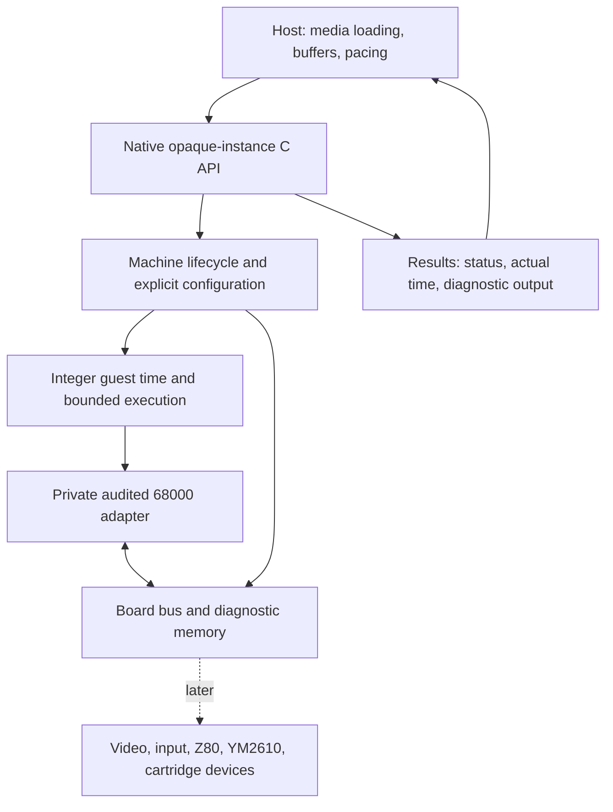

# Architecture Research

**Domain:** Portable C Neo Geo MVS/AES cartridge emulation core
**Researched:** 2026-10-01
**Confidence:** MEDIUM for technical synthesis; implementation and hardware timing remain unverified.
**Status:** Recommended design, not implemented behavior or a frozen public ABI. Current scope follows [PROJECT.md](../PROJECT.md); dated preparation remains provenance.

## Standard Architecture

### System Overview

Build one concrete machine model behind an opaque C17 instance API. Hosts supply normalized bytes, configuration and bounded execution requests. The core owns deterministic guest execution; hosts own files, archives, presentation, devices and pacing. Reused chips stay behind private adapters. The first delivery is a CPU/bus diagnostic SDK; the dashed component below is later scope. [P1, P2]



This is a dependency/ownership diagram, not a promise of cycle-level observability. An integer clock representation does not establish physical bus timing. MAME documents the extra suspension and access-retry machinery needed for its interruptible CPU model; use that as a warning about the contract's complexity, not a framework to import. [F2]

### Component Responsibilities

| Component | Responsibility and boundary | Delivery |
|---|---|---|
| Public C boundary | Opaque handle; explicit creation/load/reset/run/destruction semantics; normalized media, capacities, errors and supported-subset reporting | v0.1; names/layouts decided after gate |
| Machine ownership | Own mutable RAM, chip context, pending execution state and allocator context; unwind partial construction safely | v0.1 |
| 68000 adapter | Bind chip callbacks to the owning machine; translate timing/interrupt/error behavior; hide upstream structures and symbols | v0.1 after acceptance |
| Board bus | Explicit read/write widths, byte lanes, mapping, ordering and side effects required by the diagnostic | v0.1 subset |
| Execution coordinator | Deterministic integer time, bounded work, actual elapsed guest time and stop reason | v0.1 subset; richer event scheduling later |
| Media validation | Validate region sizes, identities, supported combinations, limits and ownership before execution | Simple diagnostic manifest in v0.1 |
| Diagnostic observation | Bounded result/trace capture through ordinary supported interfaces; evidence identifies fixture and oracle | v0.1 |
| Video/input/sound | Guest register behavior, explicit sampling points, deterministic raw output and device synchronization | Next milestone, selected cases |
| Cartridge/profile logic | Board variants, banking, protection, BIOS/region compatibility and practical media import integration | Later evidenced slices |
| Snapshot codec | Explicit guest-state encoding, validation and atomic restore at supported boundaries | Later; backend state inventory starts now |
| Persistence exchange | Guest persistent bytes with host-facing generation/acknowledgment protocol | Later |
| libretro adapter | Translate frontend contracts through the ordinary native API | Next milestone; native API remains independent |

The host must own filesystem access, decompression, media discovery, device I/O, input mapping, wall-clock reads, sleeping and network activity. There is no database or external service in the runtime architecture. [P1, P2]

## Recommended Project Structure

Proposed paths are organizational guidance; these modules and symbols do not yet exist.

```text
include/glueyneo/       Public headers only
src/api/               Native lifecycle, validation and errors
src/machine/           Ownership, board composition, guest time
src/bus/               Explicit mapped memory and register access
src/chips/             Private adapters to audited C dependencies
third_party/           Pinned sources, licenses and small patch records
diagnostics/           Original guest source and fixture manifests
tests/                 Behavioral, boundary and isolation evidence
examples/              Small ordinary-API consumer
cmake/                 Target definitions and package installation
docs/                  Current contracts and evidence index
```

Add video, sound, cartridge, state and host-adapter modules when their slices arrive. Keep private dependency headers out of installed includes. Keep third-party edits distinguishable from original MIT work, and make source archives build offline. CMake target exports and a relocated consumer must establish packaging behavior; an in-tree build cannot establish it. [P2: C-04–C-07]

## Architectural Patterns

### Pattern 1: Explicit instance ownership

**What:** One active calling thread per instance; separate instances can execute concurrently after isolation is demonstrated. Mutable machine/chip state belongs to the instance. Shared tables must be immutable during concurrent use, with a proven initialization strategy.

**When:** All native execution, reset, loading and destruction paths.

**Trade-off:** Contextizing reusable C code may cost more than its API suggests. Pinned Musashi declares global CPU, cycle, address-error and jump-buffer state. This establishes the need for an audit, not the feasibility of a small patch. [F1] A global lock is not acceptance evidence for independent instances. Do not serialize host jump buffers; recreate transient host execution machinery at safe boundaries. [P2, P4]

### Pattern 2: A bounded stop contract before a stable ABI

**What:** Specify the execution unit, zero-budget behavior, supported stop boundaries, treatment of instruction overshoot, stop reasons and actual time returned. Identify whether budget means a hard ceiling or a request completed at the next supported boundary. Check arithmetic and prevent pathological input from creating unbounded calls.

**When:** The backend experiment and first external consumer, before public layouts harden.

**Trade-off:** Instruction boundaries may support the diagnostic while being insufficient for later device interactions. Preserve the limitation in capability documentation. Do not present instruction totals, scheduler tick width or deterministic output as proof of bus-cycle accuracy. [P2, P4, F2]

For later devices, select an evidenced integer quantum and rational clock ratios with retained remainders. Define ordering for coincident events and overflow behavior. Start with concrete deadlines and simple selection; add a general event queue only for demonstrated need. Host pacing remains outside this model. [P2]

### Pattern 3: Explicit bounded data exchange

**What:** Pass media/output as pointer-plus-length with documented lifetime, ownership, capacity and failure behavior. Validate lengths before arithmetic or allocation. Report unsupported profiles explicitly. Keep callbacks cold or batched, and prohibit reentry into the executing instance.

**When:** Loading, diagnostic results, and later audio/video/state outputs.

**Trade-off:** Borrowed immutable media avoids copies but extends caller lifetime obligations. Select and document the initial policy; a copying convenience path can be added when useful. Do not expose both paths as a prerequisite for the alpha. Use defined unsigned guest arithmetic and explicit byte order rather than packed structs, bitfields or unaligned casts. [P1, P2]

### Pattern 4: Distinct state and compatibility identities

**What:** Keep library release, native ABI, snapshot schema, replay behavior and durable-save compatibility separate. Guest hashes cover canonical guest state and omit host pointers, diagnostics, delivery counters and persistence acknowledgments.

**When:** Inventory fields during the backend gate; implement full board snapshot/persistence contracts in their later slice.

**Trade-off:** Explicit schemas require maintenance, but raw struct dumps couple files to padding, pointer values and compiler layout. Future restore should validate before mutating the live machine and compare continuation at equal guest/output-consumption boundaries. Restoring older guest persistent bytes may advance host dirty generations; an old acknowledgment must not clear newer writes. [P2, P4]

## Data Flow

1. **Create/load:** Host supplies explicit configuration and normalized diagnostic spans → API validates limits/profile/lifetime → instance prepares storage and backend → load either reaches a documented valid state or reports a useful error with complete cleanup.
2. **Execute:** Host requests bounded guest work → execution coordinator runs accepted backend → backend accesses the board bus → diagnostic writes observable results → API returns actual time advanced, stop reason and output within its ownership contract.
3. **Observe:** Ordinary consumer reads the result → evidence harness compares against the fixture's justified oracle and records exact code/input/tool/configuration identity. Fixture startup must exercise initialized writable data and BSS; a bootstrap defect must not masquerade as an emulator result. [P2]
4. **Later interactive flow:** Host submits logical input at defined boundaries → device execution produces timestamped raw video/audio buffers → adapter presents them under host pacing. Output pressure must have a documented policy that does not silently alter guest time or lose samples. [P2]
5. **Later restore/durability:** Host supplies snapshot/save bytes → codec validates identity/schema/bounds → commit validated guest state → rebuild derived caches and reconcile host persistence generations → host acknowledges a particular exported generation after its own durability policy succeeds. [P4]

## Build Order and Acceptance Gates

| Order | Capability | Required architectural evidence |
|---|---|---|
| 1 | Bounded 68000 adaptation experiment | Set concrete effort/patch budget before work; pin source/config/generated files; inventory licenses, mutable fields, callbacks and initialization; prove or reject isolation and stop semantics |
| 2 | Original CPU/bus diagnostic through native API | Real guest execution with justified oracle, explicit bootstrap and bus subset; useful bounded errors; deterministic repeated/split execution at supported boundaries |
| 3 | Installable SDK alpha | C17 static/shared and offline package; real external C consumer, C++ linkage check, compiled example and relocated installation; exact tested matrix |
| 4 | Interactive diagnostic milestone | Selected video/input/sound synchronization; ordinary-API libretro adapter; actual pinned RetroArch macOS load/run/unload evidence |
| 5 | State, persistence and compatibility expansion | Actual continued execution after restore; fresh-instance reopening; dirty-generation races; practical importer and private scenarios with public-safe regressions |

Order 1 must include alternating instances, independent host threads, simultaneous cold initialization, partial creation/load failure and supported-boundary backend continuation. It must explain the oracle's ancestry; agreement with the same implementation cannot establish independent correctness. Set an accept/reject/defer decision, not an indefinite port. Inventory future Z80/audio risks, but do not require their adaptation or full board serialization for v0.1. [P1, P3, P4]

The parallel [stack research](STACK.md) also identifies SoftFloat 2b licensing terms and FPU paths with process-level error behavior in the pinned Musashi source closure. Prove that a minimal 68000 build excludes unused FPU/SoftFloat code, or audit retained files/notices and eliminate reachable unsolicited printing/process exit. The visible unconditional FPU include in the pinned CPU source makes this a build-closure and host-safety gate; a CPU-mode configuration flag alone is insufficient evidence. This finding does not approve or reject the backend before that experiment. [F1; STACK.md dependency audit]

## Scaling Considerations

| Pressure | Recommended response | Evidence needed |
|---|---|---|
| More concurrent machines | Separate instance state; parallelism supplied by the host | Cold-init races, interleaving, independent threaded execution and memory per instance |
| More supported hardware | Concrete profile/device additions with explicit capability coverage | New diagnostic plus source/oracle ancestry and regression evidence |
| More work per emulated interval | Profile scalar implementation before data-layout/SIMD changes | Representative output equivalence and measured cost; diagnostic throughput is not gameplay speed |
| More output/trace data | Bounded batches, explicit capacity policy and trace drop counts | Buffer boundaries and enabled/disabled instrumentation cost |
| More CI combinations | Small fault-driven matrix and bounded campaign lanes | Critical path, runner-minutes, cold builds and unsupported configurations |

Do not add guest-device threads, JIT or speculative caches before representative profiles. User count is not an emulator scaling dimension. [P1, P2]

## Anti-Patterns

| Anti-pattern | Consequence | Preferred design |
|---|---|---|
| Wrap singleton chip state in an opaque pointer | Apparent instances still interfere | Inventory and contextize every mutable dependency field; prove concurrent behavior |
| Lock in ABI before the backend experiment | API promises unsupported stop/state semantics | Use experiment and real consumer evidence before locking contracts |
| Run each device once per frame | Miss observable interactions | Synchronize at evidenced boundaries and disclose remaining precision limits |
| Put file/device clocks inside the library | Ambient dependencies and nondeterminism | Explicit host inputs and integer guest time |
| Fake silence/video for absent devices | Unsupported behavior appears implemented | Explicit supported-subset reporting |
| Hash host bookkeeping as guest state | Valid restore seems divergent or durability generations rewind | Separate guest identity from host delivery/acknowledgment state |
| Build every eventual subsystem before alpha | Delays the first useful execution result | Ship the CPU/bus diagnostic slice with narrow claims |

## Integration Points

| Boundary | Communication | Qualification |
|---|---|---|
| Consumer ↔ native core | Small opaque C API and explicit buffers | Ordinary installed/relocated consumer executes diagnostic |
| Machine ↔ chip | Private concrete adapter and instance-bound bus callbacks | State/init/failure audit; stop timing; isolation |
| Bus ↔ device | Width/order/side-effect contracts in guest time | Evidence for exact implemented subset; inspection does not trigger guest side effects |
| Core ↔ libretro | Thin adapter through native API | Next milestone: contract harness plus actual frontend |
| Core ↔ Playstead | Future host executable or native integration | Preparation reports process-launch integration; no existing Glueyneo FFI assumed |
| Runtime ↔ release tooling | Built artifacts and evidence manifests | Tooling is external; no credentials or telemetry in runtime |

## Unresolved Questions

- Can the selected pinned 68000 candidate satisfy isolation and complete backend state with a small maintained patch set inside the adaptation budget?
- Which stop boundary and bus timing precision can it actually expose, including exceptions and interrupt changes?
- What original diagnostic/oracle proves the first subset, and which bootstrap assumptions are independently checked?
- Which ownership/lifecycle choices survive a real consumer without prematurely expanding the API?
- Which toolchain/platform combinations actually build and execute the package? Proposed minima are not support receipts.
- Later: exact board timing profiles, Z80/audio adaptation, sample/filter contract, state format and frontend qualification remain phase-specific work.

## Sources and Confidence

All research dates below are **2026-10-01**. Local preparation is dated synthesis, not implementation evidence. Recommendations inherit its stated uncertainty. Fresh findings are **MEDIUM**, returned by OpenGSD `query classify-confidence --provider websearch --verified`; no package-legitimacy result or hardware validation was supplied. The research plan selected Jina for two targeted source checks; that tool was unavailable, so built-in web search/open checked the official sources and stored digests under the plan keys.

| ID | Exact reference / date | Supported claim and limitation |
|---|---|---|
| P1 | [PROJECT.md](../PROJECT.md), [BRIEF.md](../preparation/BRIEF.md), [DECISIONS.md](../preparation/DECISIONS.md), dated 2026-10-01 | Scope/constraints and D-15–D-25 intent; authoritative project decisions, no implementation proof |
| P2 | [C core architecture](../preparation/C-CORE-ARCHITECTURE.md), dated 2026-10-01, source ledger C-01–C-29 | Proposed boundaries, C safety, timing, packaging and state design; original ledger preserves primary URLs/revisions; inherited technical synthesis MEDIUM |
| P3 | [Roadmap seed](../preparation/ROADMAP-SEED.md), dated 2026-10-01 | Diagnostic-first dependency order and bounded device gate; proposal superseded by current canonical scope where different |
| P4 | [Adversarial review](../preparation/ADVERSARIAL-REVIEW.md), A-02/A-03 and gates, dated 2026-10-01 | Reentrancy and guest/host identity failure modes; document/source review, no executed tests |
| F1 | [Musashi m68kcpu.c](https://raw.githubusercontent.com/kstenerud/Musashi/313ebf1bd9f4d0d93341eb5ce21fd8a119e9dbdd/m68kcpu.c), revision `313ebf1bd9f4d0d93341eb5ce21fd8a119e9dbdd`, lines 52–87 | Fresh MEDIUM: mutable global CPU/cycle/error/jump-buffer declarations; inspection is partial, no whole-dependency audit or acceptance |
| F2 | [MAME CPU devices](https://docs.mamedev.org/techspecs/cpu_device.html), displayed documentation 0.289, accessed 2026-10-01 | Fresh MEDIUM: interruptibility requires suspension/restart and memory-access bookkeeping; moving documentation and implementation pattern, not Neo Geo hardware evidence |

The fresh checks corroborate the preparation's two highest-impact architecture risks. No backend was ported, test was run, timing precision measured or platform support established by this research.
